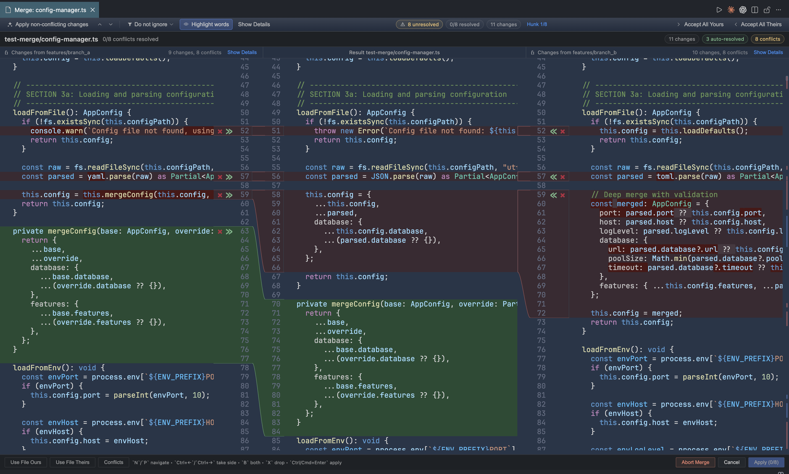
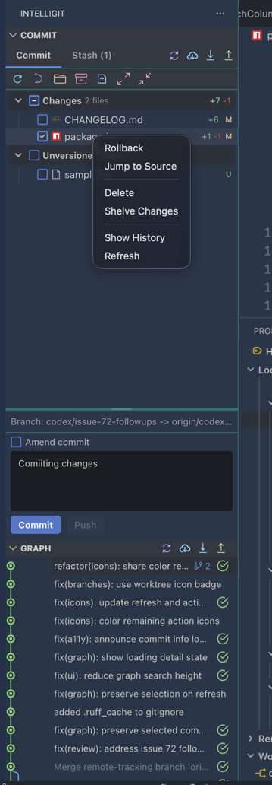
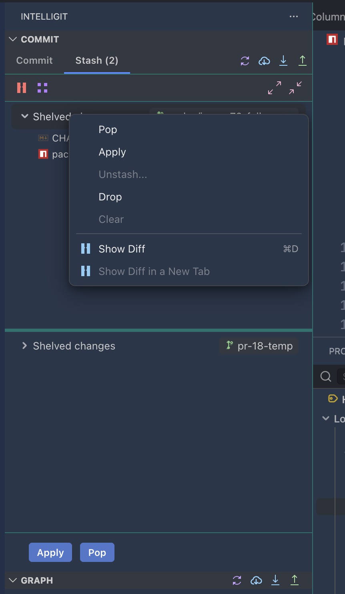
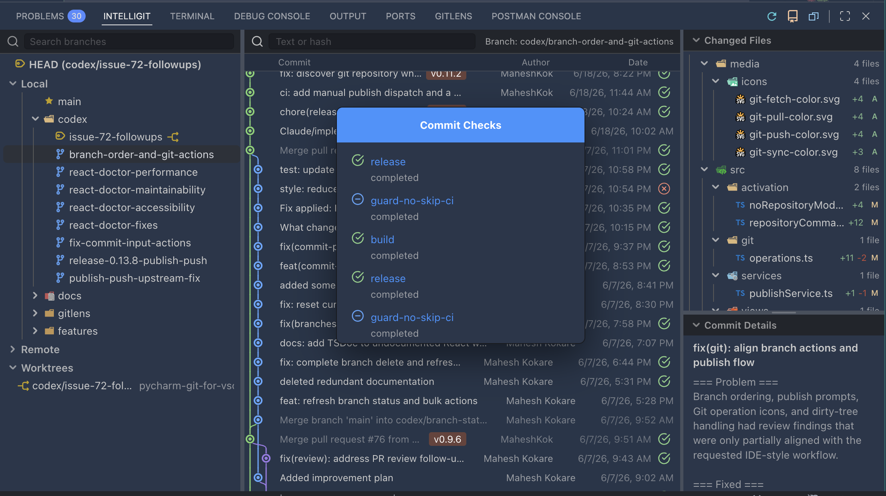
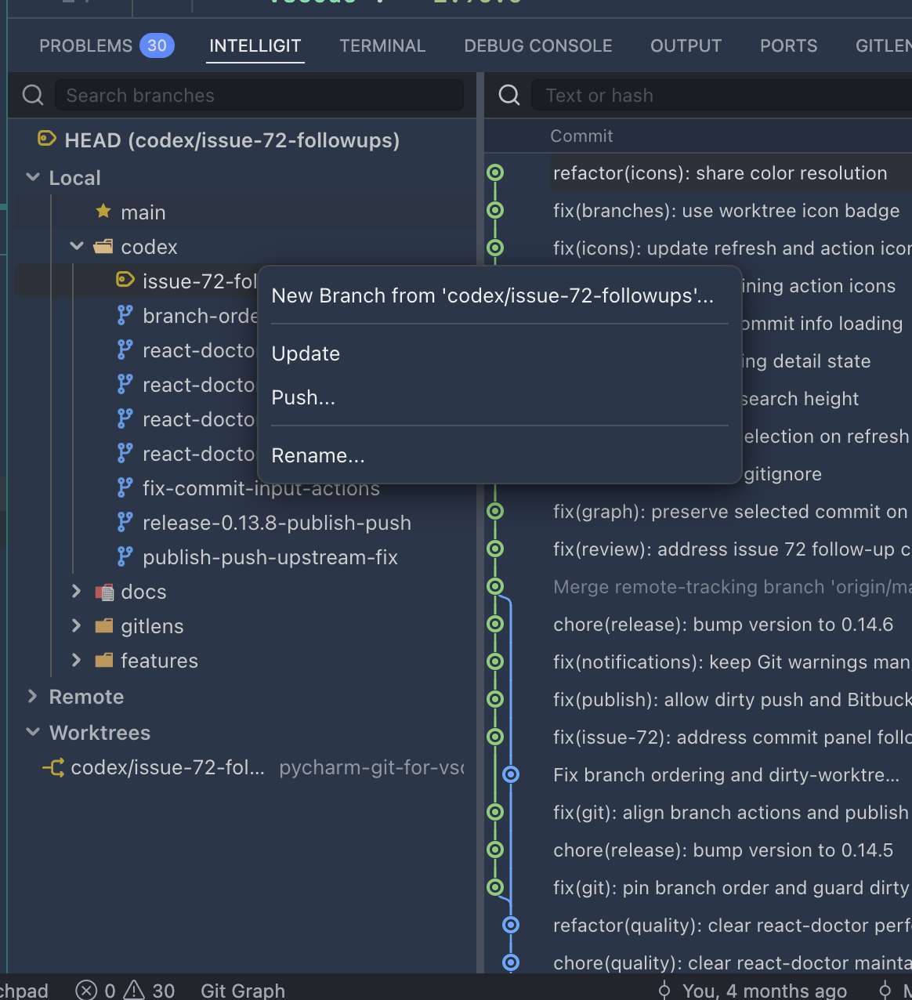
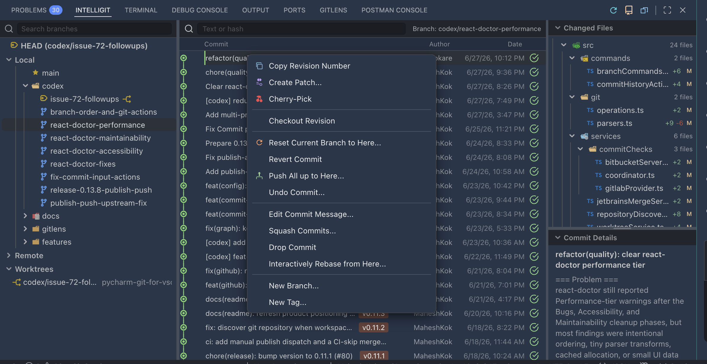
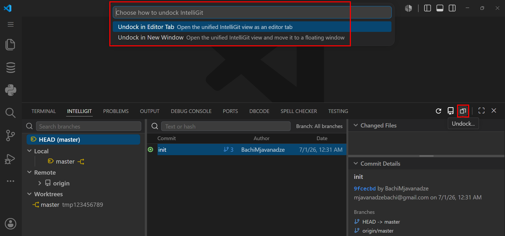
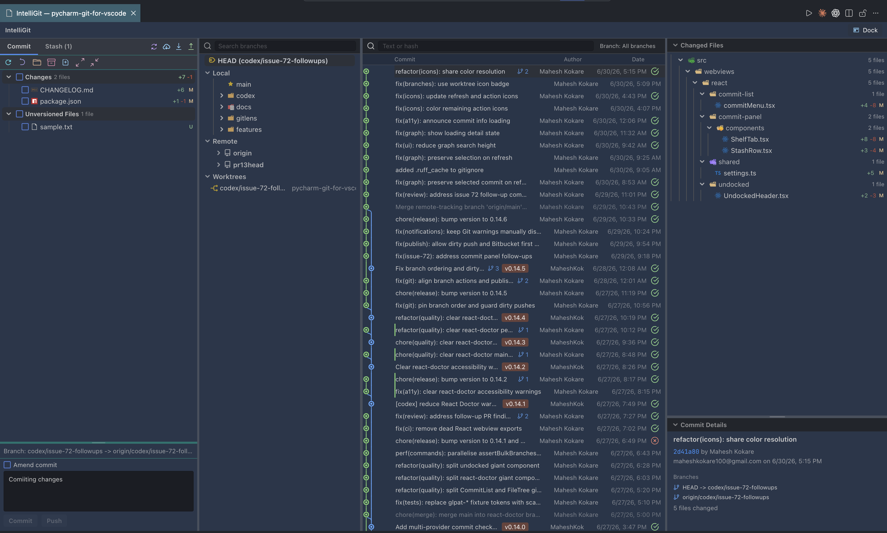
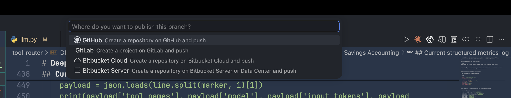

<h1 align="center">IntelliGit</h1>

<p align="center">
  <a href="package.nls.json">🇬🇧 English</a> •
  <a href="package.nls.de.json">🇩🇪 Deutsch</a> •
  <a href="package.nls.es.json">🇪🇸 Español</a> •
  <a href="package.nls.fr.json">🇫🇷 Français</a> •
  <a href="package.nls.ja.json">🇯🇵 日本語</a> •
  <a href="package.nls.ko.json">🇰🇷 한국어</a> •
  <a href="package.nls.pl.json">🇵🇱 Polski</a> •
  <a href="package.nls.pt-br.json">🇧🇷 Português</a> •
  <a href="package.nls.pt-pt.json">🇵🇹 Português</a> •
  <a href="package.nls.ru.json">🇷🇺 Русский</a> •
  <a href="package.nls.zh-cn.json">🇨🇳 简体中文</a> •
  <a href="package.nls.zh-tw.json">🇹🇼 繁體中文</a>
</p>

<p align="center">
  
</p>

<p align="center">
  <strong>JetBrains-style three-pane merge resolution and a complete Git workbench for VS Code.</strong><br />
  Compare Yours and Theirs side by side, edit the Result in the center, then continue through commits, branches, worktrees, shelves, history, and CI checks in one focused workspace.
</p>

<p align="center">
  <a href="LICENSE"></a>
  <a href="package.json"></a>
  <a href="package.json"></a>
</p>

<p align="center">
  
</p>

IntelliGit keeps complex conflict resolution in one horizontal view. Yours, the editable Result, and Theirs stay visible side by side, with aligned conflict bands, visual connectors, conflict navigation, and explicit apply or abort controls.

After the merge, the same extension provides the rest of the daily Git workflow: a focused commit panel, readable branch graph, branch and commit actions, shelf-style parking, worktree management, changed files, commit details, and CI checks.

It does not try to replace Git. It gives the daily Git work a better cockpit.

## Why IntelliGit Exists

VS Code is fast and flexible, but Git work often ends up split across the Source Control view, terminal commands, diff tabs, branch pickers, and third-party graph extensions. That is fine for small changes. It gets tiring when you are shaping commits, checking history, moving branches, or cleaning up before a push.

IntelliGit pulls those workflows into one JetBrains-inspired surface:

- Build clean commits from a focused file tree with staging, rollback, amend, commit, and commit-and-push.
- Browse history in a visual commit graph with branch lanes, search, filters, metadata, and changed files.
- Act on branches and commits from the graph instead of jumping back to the command line.
- Park unfinished work with a shelf-style stash workflow.
- Handle risky history operations with availability rules and confirmations.
- Resolve conflicts in a horizontal three-pane editor with Yours, an editable Result, and Theirs visible together, or open VS Code's native merge editor.

## Feature Gallery

### Commit Panel



The commit panel keeps the daily commit loop in one focused view. Stage by file,
folder, or whole section; keep tracked changes and unversioned files separated;
review per-file status and line deltas; then commit, push, or amend without
leaving the Git surface. File context actions cover rollback, jump to source,
delete, shelve changes, show history, and refresh.

### Shelf Workflow



The Shelf/Stash tab is built for interrupted work. Park partial or full changes,
preview the files inside a shelved entry, show a diff before restoring it, then
apply, pop, or drop the entry from the same panel. This gives VS Code a workflow
closer to JetBrains shelf handling than raw terminal stash juggling.

### Commit Graph, Changed Files, And CI Checks



The graph view combines branch search, branch lanes, commit search, changed
files, commit metadata, and CI/CD checks. Commit check badges show provider
status directly in history, and the popover exposes individual GitHub, GitLab,
Bitbucket Cloud, or Bitbucket Server checks with links back to the provider.

### Branch Actions



Branch actions live where branch decisions happen. The branch tree groups
current, local, remote, and worktree branches, then exposes context-aware actions
such as checkout, new branch, checkout-and-rebase, rebase, merge, update, push,
rename, delete, and worktree creation.

### Commit Actions



Commit history is actionable, not read-only. Right-click a commit to copy its
hash, create a patch, cherry-pick, checkout the revision, reset the current
branch, revert, push up to that commit, undo, edit the message, squash, drop,
start an interactive rebase, create a branch, or create a tag. Risky actions are
guarded by context and confirmations.

### Unified IntelliGit Workbench





When you need room, IntelliGit can run as a unified workbench tab. The `Undock`
feature allows you to undock the Git window and move it to another screen. The
commit panel, branch tree, graph lanes, changed-file tree, and commit details
stay in one layout, with dock/undock support for monitor-heavy workflows.

### Publish Branch



Publishing is not limited to pushing an existing remote. IntelliGit can create a
repository or project on GitHub, GitLab, Bitbucket Cloud, or Bitbucket Server,
add the remote, and push the selected branch through one guided flow.

## Feature Support

| Area              | Supported                                                                                                                                                          |
| ----------------- | ------------------------------------------------------------------------------------------------------------------------------------------------------------------ |
| Commit workflow   | Staging by section, folder, or file; rollback; delete; jump to source; amend; commit; push                                                                         |
| Shelf/Stash       | Shelve changes, preview files, show diff, apply, pop, drop                                                                                                         |
| Graph and history | Branch lanes, branch search, commit search, branch filter, pagination, changed files, commit metadata                                                              |
| Branches          | Checkout, new branch, checkout-and-rebase, rebase, merge, update, push, rename, delete                                                                             |
| Commits           | Copy hash, create patch, cherry-pick, checkout revision, reset, revert, push up to here, undo, edit message, squash, drop, interactive rebase, new branch, new tag |
| Worktrees         | Create, create from branch, delete, lock, unlock, move, prune, repair                                                                                              |
| Merge conflicts   | Conflict tree, conflict sessions, horizontal Yours/Result/Theirs editor, editable result, accept yours/theirs, VS Code native merge editor                         |
| Hosting           | Clone repository, initialize repository, publish branch, create remote repositories/projects                                                                       |
| Commit checks     | GitHub, GitLab, Bitbucket Cloud, Bitbucket Server, self-hosted host mapping, CI/CD status popovers                                                                 |
| Layout            | Activity bar view, bottom graph panel, unified undocked workbench tab                                                                                              |
| Localization      | English, German, Spanish, French, Japanese, Korean, Polish, Portuguese, Russian, Simplified Chinese, Traditional Chinese                                           |

## Quick Start

1. Install IntelliGit.
2. Open a Git repository in VS Code.
3. Open IntelliGit from the activity bar.
4. Use the `Commit` tab to stage files and commit.
5. Open the bottom IntelliGit panel to inspect history, filter branches, and act on commits.

## Installation

Search for **IntelliGit** in VS Code Extensions, or install from:

- [VS Code Marketplace](https://marketplace.visualstudio.com/items?itemName=MaheshKok.intelligit)
- [Open VSX Registry](https://open-vsx.org/extension/MaheshKok/intelligit)

## Requirements

- VS Code `1.96.0` or later
- Git installed and available on `PATH`

## Settings

Configure IntelliGit from VS Code Settings or `settings.json`.

```jsonc
{
    // Enable tooltips inside IntelliGit webviews.
    "intelligit.tooltips.enabled": true,

    // Open IntelliGit as a unified editor tab when Show Git Log is invoked.
    "intelligit.undockableWindow": false,

    // Icon style used in IntelliGit panels: "standard" or "color".
    "intelligit.icons": "standard",

    // Commit panel position inside the undocked/tabbed IntelliGit window: "auto", "left", or "right".
    "intelligit.commitWindowPosition": "auto",
}
```

## Development

```bash
bun install
bun run build
bun run watch
bun run lint
bun run typecheck
bun run test
bun run format
```

### Documentation Standards

Use the IntelliGit TSDoc standard in [docs/tsdocs/TSDOC.md](docs/tsdocs/TSDOC.md) when documenting exported or boundary-facing TypeScript/TSX symbols. Prefer comments that capture contracts, invariants, side effects, and trust boundaries over comments that repeat TypeScript types. The rollout plan is tracked in [docs/tsdocs/codex-tsdoc-rollout-plan.md](docs/tsdocs/codex-tsdoc-rollout-plan.md).

Contributor and reviewer checklist:

- Update TSDoc in the same change that adds or changes exported/boundary-facing TypeScript or TSX symbols.
- Reject comments that only restate types, use vague verbs such as "handles" or "returns", or describe behavior that is no longer true.
- Keep the source documentation ratchet enabled; do not weaken lint enforcement to land undocumented exports.
- During release maintenance, scan for stale `@todo`, `TODO`, `FIXME`, `@deprecated`, and `@remarks` notes in `src` and `docs`.

### Manual Extension Test

```bash
bun install
bun run build
bun run package
code --install-extension intelligit-*.vsix
```

### Test Suite

```bash
# Run all unit and integration tests.
bun run test

# Watch mode.
bun run test -- --watch

# Run a specific test file.
bun run test -- tests/unit/gitops.test.ts

# Run tests matching a pattern.
bun run test -- -t "CommitPanelApp"
```

## Architecture

```text
GitExecutor (simple-git wrapper)
    |
GitOps (operations layer)
    |
View Providers (extension host orchestration)
    |
Webviews (React apps for commit panel and commit graph)
```

Data flow highlights:

1. Commit selection in the graph requests commit details from the extension host and updates the detail pane.
2. Branch selection filters the graph and clears stale commit detail state.
3. Commit panel file count updates the activity badge.
4. Refresh reloads branch state, history, and commit panel data together.

## Tech Stack

| Component       | Technology         |
| --------------- | ------------------ |
| Extension host  | TypeScript, ES2022 |
| Git operations  | simple-git v3      |
| Webviews        | React 18           |
| Graph rendering | HTML5 Canvas       |
| Bundler         | esbuild            |
| Package manager | Bun                |
| Testing         | Vitest             |
| Linting         | ESLint             |
| Formatting      | Prettier           |

## License

[MIT](LICENSE)
