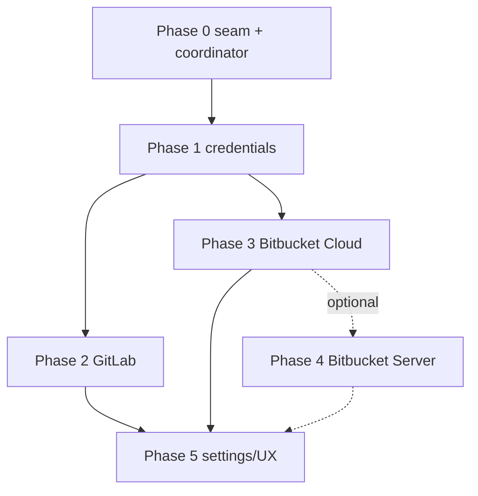

# Multi-Provider Commit Checks — Implementation Runbook

Executable companion to [multi-provider-commit-checks-plan.md](./multi-provider-commit-checks-plan.md).
That doc is the architecture and API reference. This doc is the step-by-step
build order: for each phase — objective, what to read first, how to build it,
what to check, how to verify, how to test, and the done criteria. An LLM (or a
human) can pick up any phase in order and implement it without further context.

No emojis. TypeScript strict, Node extension host, React webview. Use `bun` for
all tooling; never `npx`.

---

## 0. Global definition of done (applies to every phase)

A phase is complete only when ALL of these pass. Do not skip; do not weaken a
test to make it pass.

```bash
bun run typecheck          # tsc ext + webview, no errors
bun run lint               # eslint src scripts, no errors
bun run format:check       # prettier --check, no diffs
bun run architecture:check # dependency-cruiser, no boundary violations
bun run build              # bundles ext + webview, no errors
bun run test -- --run      # full Vitest suite green
bun run test:coverage      # >=80% lines on new code (see below)
```

Advisory (run and read, but not gating on their own): `bun run react-doctor`
and `bun run deps:check` (knip). Investigate anything they surface, but a finding
here does not by itself block the phase.

Plus:

- New modules have spec-derived tests with adversarial cases (boundary, null,
  error paths), not happy-path-only. Target >=80% line coverage on new code.
- Mocks touch only the network boundary (the injected `fetchJson`). Never mock
  internal mapping/aggregation.
- No hardcoded user-facing strings — wrap with `vscode.l10n.t(...)`.
- No secret/token in logs, errors, fixtures, or test output.
- Immutability: return fresh snapshots; never mutate a cached entry.
- Files stay under ~800 lines; one public class/provider per file.
- Conventional-commit message; do not add Claude as co-author; do not push
  unless the user asks.

If any step is red, stop and fix before moving on. A later phase must never be
started on top of a red earlier phase.

---

## 1. Shared context every phase needs

Read these before touching code (paths verified against the current tree):

- `src/types.ts` — the contract. `CommitChecksSnapshot { hash, state, summary,
  items, error? }`, `CommitCheckItem { name, description, state, source, url? }`,
  `CommitCheckState` (the 11-value union), `isPendingCheckState`. Do not change
  these without a stated reason; every provider normalizes INTO this shape.
- `src/services/githubCommitChecksService.ts` — the reference implementation to
  generalize. Note `getGithubCommitChecks`, `parseGithubRemoteUrl`, the
  `githubGetJson` HTTP helper, and the pure mappers (`aggregateState`,
  `isCiCdCheckItem`, `summaryForItems`, `mapCheckRunState`, `mapStatusState`,
  `compactText`, `readString`).
- `src/views/CommitGraphViewProvider.ts` — `sendCommitChecks` (~line 442) and the
  `commitChecksCache` field (~line 60). One of two call sites.
- `src/views/UndockedViewProvider.ts` — the second, duplicated call site (~line
  652) and its own `commitChecksCache`. Its `sendCommitChecks` now guards with
  `!isPendingCheckState(cached.state)`, matching the docked provider (the prior
  `!== "pending"` bug that cached `none` forever is fixed).
- `tests/integration/extension/view-providers.integration.test.ts` — has
  "refetches cached pending" + "none -> refetch" tests for BOTH the docked
  (`CommitGraphViewProvider`) and undocked (`UndockedViewProvider`) providers, each
  mocking `getGithubCommitChecks`. These mocks move to the coordinator in Phase 0.
- `tests/unit/services/githubCommitChecksService.test.ts` (if present) — existing
  GitHub mapping tests; they move with the code, not weakened.

Conventions in this codebase:

- HTTP is raw Node `https.get` wrapped in a Promise with a 15s timeout. Keep that;
  just generalize host/headers.
- `GitOps.getRemotes()` and `GitOps.getRemoteUrl(remote)` are the only Git inputs
  needed for host detection. Reuse, do not reinvent.
- Localization has three separate targets; pick by where the string lives, and do
  NOT hand-edit generated locale JSON:
  - manifest strings (command titles, setting descriptions in `package.json`) ->
    `package.nls.json` (+ `package.nls.<locale>.json`).
  - host runtime strings passed to `vscode.l10n.t(...)` -> `l10n/bundle.l10n.json`.
  - webview (React) strings -> `src/webviews/i18n/en.json`.
  All three are driven by the CSV pipeline: edit the source CSV, regenerate with
  `bun run l10n:sync` / `bun run l10n:import`, then check with `bun run l10n:validate`
  / `bun run l10n:audit`. Never edit a generated `<locale>` JSON by hand.

### Testability decision (do this once, in Phase 0)

Make the HTTP call an injected dependency so unit tests mock only the boundary:

```ts
// src/services/commitChecks/http.ts
export type FetchJson = (url: string, headers: Record<string, string>) => Promise<unknown>;
export const httpGetJson: FetchJson = (url, headers) => { /* https.get, 15s timeout */ };
```

Every provider takes a `FetchJson` in its constructor (default `httpGetJson` in
production, a fake in tests). This is composition over module-mocking and keeps
mapping logic fully unit-testable.

---

## Phase 0 — Provider seam and coordinator (refactor only)

### Objective
Introduce the `CommitChecksProvider` abstraction and a `CommitChecksCoordinator`
that owns detection + cache; move GitHub behind it; delete the duplicated cache
in the two view providers. Zero behavior change for GitHub users.

### Prerequisites
Read everything in section 1. Confirm the two call sites and the integration
test that mocks `getGithubCommitChecks`.

### Approach (build order)
1. Create `src/services/commitChecks/http.ts` — `FetchJson` type + `httpGetJson`
   (generalize `githubGetJson`: parametrize base URL and headers; keep the 15s
   timeout and the `>=300 -> reject` behavior).
2. Create `src/services/commitChecks/normalize.ts` — move the pure mappers verbatim:
   `aggregateState`, `isCiCdCheckItem`, `summaryForItems`, `summaryForState`,
   `compactText`, `readString`, plus `CICD_CHECK_PATTERN` / `REVIEW_CHECK_PATTERN`.
   No logic change.
3. Create `src/services/commitChecks/types.ts` — `ProviderRepoRef`,
   `CommitChecksProvider` interface (`id`, `match(remoteUrl, hostMap)`,
   `getChecks(ref, hash)`), and `HostMap = Record<string, ProviderId>`.
4. Create `src/services/commitChecks/githubProvider.ts` — a class implementing the
   interface; `match` wraps `parseGithubRemoteUrl`; `getChecks` performs the two
   GitHub fetches (via injected `FetchJson`) and calls the moved `normalize`.
   GitHub keeps using `vscode.authentication.getSession("github", ["repo"])`.
5. Create `src/services/commitChecks/coordinator.ts` —
   `class CommitChecksCoordinator { constructor(gitOps, providers, hostMap); async getChecks(hash): Promise<CommitChecksSnapshot> }`.
   It resolves remotes on every `getChecks` call, picks the first matching provider,
   owns the per-hash `Map<string, CommitChecksSnapshot>` cache, and serves the cache
   only when `!isPendingCheckState(state)` (terminal); otherwise it re-fetches (the
   rule currently in `sendCommitChecks`). Do NOT memoize the detection
   (provider + ref): the active repository can change at runtime via
   `intelligit.selectRepository`, and GitHub today re-resolves remotes on every
   fetch — keep that. Detection is a cheap string parse over `getRemotes()`; the
   network round-trip, not detection, is what the per-hash cache exists to avoid.
6. Edit `CommitGraphViewProvider` and `UndockedViewProvider`: delete their
   `commitChecksCache` and the `getGithubCommitChecks` import/call; instantiate one
   coordinator; `sendCommitChecks` becomes `post(setCommitChecks, await coordinator.getChecks(hash))`.
   Both providers now use the same `!isPendingCheckState(cached.state)` guard — the
   earlier Undocked divergence (cached `none` served forever via `!== "pending"`)
   was fixed, with a regression test in `view-providers.integration.test.ts`. Move
   that single corrected rule into the coordinator, not the providers.
7. Replace `src/services/githubCommitChecksService.ts`: either delete and update
   imports, or leave a one-line re-export for any stragglers (prefer delete).

### What to check
- The "serve cached snapshot unless `isPendingCheckState(state)`" behavior lives in
  exactly one place now (coordinator), not duplicated.
- Non-GitHub remotes still yield the same silent result as today (a `none`/
  unavailable snapshot, no error popups).
- No provider imports another provider; `normalize.ts` and `http.ts` import no
  provider. SRP intact.
- Cache key is the commit hash; entries are never mutated.

### How to verify
```bash
bun run typecheck && bun run lint && bun run test -- --run
```
Manual smoke (optional): open the extension on a GitHub repo, confirm badges and
the popover are unchanged; push a commit and confirm the pending -> success
transition still auto-updates (the Phase regression you already fixed).

### How to test
- `tests/unit/services/commitChecks/coordinator.test.ts` (new): inject a fake
  provider registry. Cases:
  - picks GitHub for a github.com remote; picks none for an unknown host.
  - first matching provider wins when multiple remotes exist; `origin` is tried first.
  - cache miss calls provider once; second call with a terminal cached state does
    NOT call the provider again; a cached `pending`/`none` DOES re-fetch.
  - provider that throws -> coordinator returns an unavailable snapshot (never throws).
- Move existing GitHub mapping tests into
  `tests/unit/services/commitChecks/githubProvider.test.ts`; keep every case.
- Update `view-providers.integration.test.ts`: change the mock target from
  `getGithubCommitChecks` to the coordinator method (or inject a fake coordinator).
  The existing behaviors ("refetch pending", "none -> refetch") must still pass for
  both the docked and undocked providers.

### Done
All of section 0 green; GitHub behavior provably identical; duplication removed.
Suggested commit: `refactor(commit-checks): extract provider seam and coordinator`.

---

## Phase 1 — Credentials (SecretStorage)

### Objective
A token store and sign-in/out commands for non-GitHub providers. GitHub keeps the
built-in session.

### Prerequisites
Phase 0 merged/green. Know how the extension passes `vscode.ExtensionContext`
(for `context.secrets`) to services — trace from `activate(...)` in `src/extension.ts`.

### Approach
1. `src/services/commitChecks/credentialStore.ts` —
   `class CredentialStore { constructor(secrets: vscode.SecretStorage); get(host); set(host, token); delete(host) }`.
   Key format `intelligit.commitChecks.token:<host>`. No token ever logged.
2. Register commands `intelligit.commitChecks.signIn` and `signOut` in
   `package.json` (commands + activationEvents) and wire in `extension.ts`:
   QuickPick the provider/host, then `showInputBox({ password: true })`, then
   `set`/`delete`. Show a localized confirmation.
3. Pass the store into the coordinator so providers can read tokens by host.

### What to check
- Missing key returns `undefined` (not throw).
- Overwriting a host replaces, does not append.
- Hosts are isolated (token for `gitlab.com` never returned for `bb.acme.com`).
- The token is absent from any thrown error string and from logs.

### How to verify
```bash
bun run typecheck && bun run lint && bun run test -- --run
```

### How to test
- `tests/unit/services/commitChecks/credentialStore.test.ts` with a fake
  `SecretStorage` (a `Map`-backed stub): set/get/delete, missing -> undefined,
  overwrite, host isolation, and an assertion that a serialized error built from a
  failed fetch does not contain the token value.

### Done
Section 0 green; token round-trips; redaction asserted.
Suggested commit: `feat(commit-checks): add SecretStorage credential store and sign-in`.

---

## Phase 2 — GitLab provider

### Objective
Show correct badges for gitlab.com and configured self-hosted GitLab.

### Prerequisites
Phases 0-1 green. Re-read the GitLab section in the plan (endpoints, auth, state
map). Have a `read_api`-scoped PAT for manual verification.

### Approach
1. `src/services/commitChecks/gitlabProvider.ts`:
   - `match(remoteUrl, hostMap)`: gitlab.com plus any host mapped to `gitlab`.
     `projectPath` must support nested groups (do NOT cap path segments at 2 the
     way GitHub does); strip trailing `.git`; handle ssh/https/scp forms.
   - `getChecks(ref, hash)`: GET
     `https://<host>/api/v4/projects/<encoded projectPath>/repository/commits/<sha>/statuses?per_page=100`
     with header `PRIVATE-TOKEN: <token from store>`. Map each row's `status` via
     the GitLab table, reuse `isCiCdCheckItem` + `aggregateState` + `summaryForItems`.
     Missing token -> unavailable snapshot whose `error` invites sign-in.
2. Register in the coordinator registry (after GitHub).

### State map (status -> CommitCheckState)
success->success; failed->failure; running/pending/created/preparing/waiting_for_resource/scheduled->pending;
canceled->cancelled; skipped->skipped; manual->action_required; other->unknown.

### What to check
- Nested-group URLs resolve to the full `group/subgroup/repo` path, URL-encoded once.
- A 401/403 yields unavailable with a sign-in hint, not a crash.
- Empty statuses array -> `none` (badge hidden, same as GitHub no-checks).
- Only `https` hosts are queried; an unmapped self-hosted host -> no provider match.

### How to verify
```bash
bun run typecheck && bun run lint && bun run test -- --run
```
Manual: set a token via the sign-in command, open a GitLab-origin repo, confirm a
commit with a pipeline shows the aggregated badge and per-check popover rows.

### How to test
`tests/unit/services/commitChecks/gitlabProvider.test.ts` with an injected
`FetchJson` returning recorded JSON (no live network):
- match: ssh + https, nested groups, trailing `.git`, non-GitLab host -> null,
  http (non-https) remote -> null.
- state mapping: a fixture exercising every `status` value incl. `manual`,
  `canceled`, `skipped`; assert the independently-derived aggregate.
- empty statuses -> `none`; mixed pending+success -> pending; any failed -> failure.
- 401 -> unavailable with sign-in hint; timeout (fetch rejects) -> unavailable.
- CI/CD filter: a `manual` job named "deploy" is kept; a row named "coderabbit" is
  excluded (review filter).

### Done
Section 0 green; >=80% coverage on the module; manual GitLab smoke passes.
Suggested commit: `feat(commit-checks): add GitLab provider`.

---

## Phase 3 — Bitbucket Cloud provider

### Objective
Show correct badges for bitbucket.org repositories.

### Prerequisites
Phases 0-2 green. A Bitbucket API token / repository access token with read scope
for manual verification. Atlassian is sunsetting app passwords — use a token, not a
username + app password.

### Approach
1. `src/services/commitChecks/bitbucketCloudProvider.ts`:
   - `match`: bitbucket.org; `projectPath = workspace/repo`.
   - `getChecks`: GET
     `https://api.bitbucket.org/2.0/repositories/<workspace>/<repo>/commit/<sha>/statuses?pagelen=100`,
     auth `Authorization: Bearer <token>`, where `<token>` is the single value from
     the credential store (Phase 1). Do NOT use Basic `username:app_password`: the
     store holds one token per host with no slot for a username, and Atlassian is
     deprecating app passwords. Follow the `next` pagination link up to a small cap
     (e.g. 5 pages) so a commit with many statuses is fully read but a runaway is
     bounded.
     Map `state` via the Bitbucket table; reuse the shared normalize helpers.
2. Register in the coordinator.

### State map (state -> CommitCheckState)
SUCCESSFUL->success; FAILED->failure; INPROGRESS/PENDING->pending; STOPPED->cancelled;
(pipeline result EXPIRED, if pipelines are added later)->timed_out.

### What to check
- Pagination: a single page works; a `next` link is followed exactly to the cap;
  the cap is honored (no infinite loop).
- The `Authorization: Bearer <token>` header carries the stored token verbatim; the
  token never appears in logs, errors, or fixtures.
- Empty `values` -> `none`.

### How to verify
```bash
bun run typecheck && bun run lint && bun run test -- --run
```
Manual: sign in, open a bitbucket.org repo, confirm a commit's build status badge
and popover.

### How to test
`tests/unit/services/commitChecks/bitbucketCloudProvider.test.ts` with injected
`FetchJson`:
- match: ssh + https, trailing `.git`, non-Bitbucket host -> null.
- pagination: no `next` (one call); one `next` then stop (two calls); a chain
  longer than the cap stops at the cap (assert call count).
- state map incl. STOPPED->cancelled; empty values -> `none`.
- 401 -> unavailable with sign-in hint; timeout -> unavailable.
- token redaction assertion.

### Done
Section 0 green; >=80% coverage; manual Bitbucket Cloud smoke passes.
Suggested commit: `feat(commit-checks): add Bitbucket Cloud provider`.

---

## Phase 4 — Bitbucket Server / Data Center (optional)

### Objective
Self-hosted Bitbucket support, gated behind the host config map. Only do this if a
user needs it.

### Approach
`src/services/commitChecks/bitbucketServerProvider.ts`: base
`https://<host>/rest`, GET `/build-status/1.0/commits/<sha>`, `Authorization:
Bearer <http access token>`. States: SUCCESSFUL->success, FAILED->failure,
INPROGRESS->pending. Register only when a host maps to `bitbucket-server`.

### What to check / verify / test
Same shape as Phase 3 (match, state map, empty -> none, 401/timeout -> unavailable,
redaction). Add a coordinator test that a `bitbucket-server`-mapped host selects
this provider and an unmapped host does not.

### Done
Section 0 green; Cloud users unaffected (assert no regression in their tests).
Suggested commit: `feat(commit-checks): add Bitbucket Server provider`.

---

## Phase 5 — Settings, UX, localization, rate limits

### Objective
Make it configurable, discoverable, localized, and API-friendly.

### Approach
1. `package.json` `contributes.configuration` (new block):
   - `intelligit.commitChecks.enabled` (boolean, default true).
   - `intelligit.commitChecks.hosts` (object, host -> provider id) for self-hosted.
   - `intelligit.commitChecks.providers` (per-provider enable toggles).
   - `intelligit.commitChecks.ciCdFilter` (optional regex string; default keeps the
     current patterns).
   Read these in the coordinator; an unmapped/disabled provider yields no badge.
2. Actionable auth error: when a snapshot is `unavailable` due to a missing token,
   surface a "Sign in to <provider>" affordance that runs the Phase 1 command. The
   snapshot already carries `error`; wire the command in the view layer.
3. Localize every new string into the right target (see section 1): manifest
   strings -> `package.nls.json`, host runtime strings -> `l10n/bundle.l10n.json`,
   webview strings -> `src/webviews/i18n/en.json`. Add the source rows to the
   localization CSV and regenerate with `bun run l10n:import` (then `l10n:validate`
   / `l10n:audit`); do not hand-edit the generated locale JSON.
4. Rate limits / caching: keep the coordinator's per-hash cache. Terminal states are
   cached indefinitely (already the Phase 0 rule). Non-terminal (`pending`/`none`) and
   recoverable `unavailable` states re-fetch on each 15s poll, but a coordinator TTL
   (`DEFAULT_COMMIT_CHECKS_TTL_MS`, 15s) bounds that so a hot commit is not hammered.

   **Approved scope deviation (was P1):** this phase ships a fixed TTL only — it does
   NOT parse a server-sent `Retry-After` / rate-limit-reset header. The TTL is an
   *approximation* of backoff: while a host stays rate-limited (HTTP 429 →
   `unavailable`), the coordinator still re-fetches once per TTL; it does not honor a
   server clear-time. This is a throttle ("at most one request per TTL"), not literal
   `Retry-After` handling. Literal `Retry-After` is a tracked follow-up, not a Phase 5
   deliverable. Upgrade path: thread the response headers through the `FetchJson` /
   `httpGetJson` contract so the coordinator can store and honor a per-host
   `retryAfter` timestamp; until then the fixed TTL is the only backoff signal.
5. `docs/commit-checks/README.md`: setup (tokens, scopes, self-hosted host mapping).

### What to check
- Disabling a provider or the feature stops all its network calls.
- An unknown locale falls back to English (default `package.nls.json`).
- Under repeated polling, a rate-limited host is not hammered (cache served).

### How to verify
```bash
bun run typecheck && bun run lint && bun run test -- --run
```
Manual: toggle settings and confirm badges appear/disappear; trigger an auth error
and confirm the sign-in affordance works end to end.

### How to test
- Coordinator tests for settings gating (enabled=false -> never calls a provider;
  host map drives selection; per-provider toggle respected).
- A custom `ciCdFilter` regex changes which items are kept.
- TTL (the point is the non-terminal path — terminal caching is already covered by the
  Phase 0 coordinator tests): with a fake clock, a second call for a `pending` state
  within the TTL serves the cache (provider NOT called again); once the TTL elapses, the
  same `pending` state DOES re-fetch. A simulated 429 (`unavailable`) behaves the same —
  cache-served within the TTL, re-fetched (auto-recover) after it. There is NO
  `Retry-After` test because the implementation does not read that header (see the
  approved scope deviation above); the TTL is the only backoff signal.

### Done
Section 0 green; settings honored; localized; sign-in reachable from a failed badge.
Suggested commit: `feat(commit-checks): settings, sign-in UX, and rate-limit caching`.

---

## 6. Build order and dependencies



MVP = Phases 0-3. Phase 0 must land first (everything depends on the seam).
Phases 2 and 3 are independent after Phase 1 and can be done in either order or in
parallel by two implementers. Phase 5 is last because it tunes the finished set.

## 7. Per-phase pull request checklist (paste into each PR)

- [ ] `bun run typecheck` clean
- [ ] `bun run lint` clean
- [ ] `bun run test -- --run` green
- [ ] New module(s) >=80% covered; tests are spec-derived and adversarial
- [ ] Only the network boundary is mocked
- [ ] No hardcoded user-facing strings; new strings added via the l10n CSV and
      regenerated into `package.nls.json` / `l10n/bundle.l10n.json` /
      `src/webviews/i18n/en.json` (whichever applies), not hand-edited
- [ ] No token/secret in code, logs, errors, or fixtures
- [ ] GitHub behavior unchanged (no regression in existing tests)
- [ ] Conventional-commit title; no Claude co-author; not pushed without request
