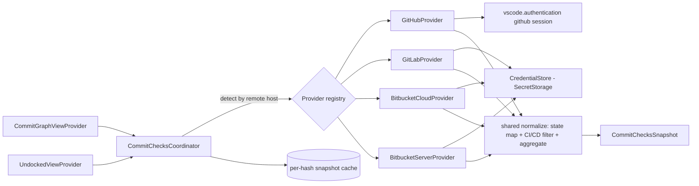

# Multi-Provider Commit Checks — Implementation Plan

Extend the existing GitHub commit-checks feature (CI/CD status badges on commit
rows) to GitLab and Bitbucket, without changing the webview. Each phase is a
self-contained unit of work with files, tests, and acceptance criteria.

No emojis. Target VS Code extension host (Node), TypeScript 4.x/strict, React
webview. Use `bun` for all tooling, never `npx`.

---

## A. Verified current state (read before planning)

GitHub support lives in one service and two near-identical call sites:

- `src/services/githubCommitChecksService.ts`
  - `getGithubCommitChecks(gitOps, hash)` — resolves the GitHub repo from
    remotes, gets a VS Code `github` auth session (scope `repo`), fetches
    `/commits/:sha/check-runs` and `/commits/:sha/statuses` in parallel, then
    normalizes into a `CommitChecksSnapshot`.
  - `parseGithubRemoteUrl(url)` — host-locked to `github.com` (SSH, HTTPS, scp).
  - `normalizeGithubChecks` / `aggregateState` / `isCiCdCheckItem` /
    `mapCheckRunState` / `mapStatusState` — provider-specific mapping into the
    shared vocabulary.
- `src/views/CommitGraphViewProvider.ts:448` — `sendCommitChecks`: `cache.get` →
  `getGithubCommitChecks` → `cache.set` → post `setCommitChecks`.
- `src/views/UndockedViewProvider.ts:657` — identical cache+fetch+post block
  (duplicated logic and a duplicated `commitChecksCache: Map<string, CommitChecksSnapshot>`).

Provider-agnostic already (no change needed):

- `src/types.ts` — `CommitChecksSnapshot`, `CommitCheckItem`, `CommitCheckState`,
  `isPendingCheckState`. The state vocabulary is the common contract.
- The entire webview (`CommitChecksPopover.tsx`, `CommitList.tsx`,
  `NativeCommitGraph.tsx`, `CommitGraphPanel.tsx`) consumes `CommitChecksSnapshot`
  by hash and never names GitHub.

Auth reality (the central constraint):

- VS Code ships a built-in `github` authentication provider — used today via
  `vscode.authentication.getSession("github", ["repo"])`.
- VS Code ships **no** built-in `gitlab` or `bitbucket` auth provider. Relying on
  third-party extensions' providers is fragile. The pragmatic, battle-tested path
  is a Personal Access Token / App Password held in `vscode.SecretStorage`,
  entered through a sign-in command.

Other facts:

- Command id prefix is `intelligit.` (`package.json` activationEvents/commands).
- There is currently **no** `contributes.configuration` block in `package.json`;
  settings must be added.
- `GitOps` exposes `getRemotes()` and `getRemoteUrl(remote)` — provider-agnostic,
  reused for host detection across all providers.

---

## B. Goal and non-goals

Goal: commit rows show the same CI/CD status badge and popover when the origin is
GitLab (SaaS or self-hosted) or Bitbucket (Cloud or Data Center), reusing the
existing snapshot shape, cache, poll loop, and UI.

Non-goals (YAGNI for this plan):

- Triggering, retrying, or cancelling pipelines.
- Per-job logs, artifacts, or deep pipeline drill-down beyond the existing
  per-check list in the popover.
- Merge-request / pull-request review state (kept out by the existing
  `REVIEW_CHECK_PATTERN` filter; unchanged).

---

## C. Target architecture



Key seam: a `CommitChecksProvider` interface plus a `CommitChecksCoordinator`
that (a) detects the provider from the repo remotes, (b) owns the per-hash cache
(removing the duplication between the two view providers), and (c) returns a
`CommitChecksSnapshot`. The view providers call the coordinator instead of
`getGithubCommitChecks`.

### Provider interface (new)

```ts
// src/services/commitChecks/types.ts
export interface ProviderRepoRef {
    host: string;        // api host, e.g. "gitlab.com" or "git.acme.com"
    projectPath: string; // "owner/repo" or "group/subgroup/repo"
}

export interface CommitChecksProvider {
    readonly id: "github" | "gitlab" | "bitbucket-cloud" | "bitbucket-server";
    /** Returns a ref when this remote URL belongs to the provider, else null. */
    match(remoteUrl: string, config: HostMap): ProviderRepoRef | null;
    /** Fetches and normalizes checks for one commit. Never throws; returns an
     *  unavailable snapshot on auth/network failure with a user-facing error. */
    getChecks(ref: ProviderRepoRef, hash: string): Promise<CommitChecksSnapshot>;
}
```

Shared helpers extracted once and reused by every provider:

- `httpGetJson(url, headers, { timeoutMs })` — generalized from the current
  `githubGetJson` (drop the hardcoded `api.github.com` and GitHub headers).
- `aggregateState(items)`, `isCiCdCheckItem(item)`, `summaryForItems`,
  `compactText`, `readString` — moved verbatim from the GitHub service.

---

## D. Provider API reference (verify against live docs before coding each phase)

### GitHub (existing — moved, not rewritten)

- `GET https://api.github.com/repos/:owner/:repo/commits/:sha/check-runs`
- `GET https://api.github.com/repos/:owner/:repo/commits/:sha/statuses`
- Auth: `Authorization: Bearer <vscode github session token>`.

### GitLab (gitlab.com and self-hosted)

- Base: `https://<host>/api/v4`. Project id = `encodeURIComponent(projectPath)`.
- Commit statuses (mirrors GitHub statuses, includes pipeline + external):
  `GET /projects/:id/repository/commits/:sha/statuses?per_page=100`
  → array of `{ name, status, description, target_url, allow_failure }`.
- Optional enrichment (pipeline-level rollup):
  `GET /projects/:id/pipelines?sha=:sha` → `[{ id, status, web_url }]`.
- Auth: `PRIVATE-TOKEN: <pat>` (scope `read_api`) or `Authorization: Bearer <oauth>`.

State map (`status` → `CommitCheckState`):

| GitLab | maps to |
|---|---|
| success | success |
| failed | failure |
| running, pending, created, preparing, waiting_for_resource, scheduled | pending |
| canceled | cancelled |
| skipped | skipped |
| manual | action_required |
| (other) | unknown |

### Bitbucket Cloud

- Base: `https://api.bitbucket.org/2.0`.
- Build statuses:
  `GET /repositories/:workspace/:repo/commit/:sha/statuses?pagelen=100`
  → `{ values: [{ key, name, state, url, description }] }`.
- Optional pipelines:
  `GET /repositories/:workspace/:repo/pipelines/?target.commit.hash=:sha&sort=-created_on`.
- Auth: `Authorization: Basic base64(username:app_password)` (scope `repository`)
  or `Authorization: Bearer <access token>`.

State map (`state` → `CommitCheckState`):

| Bitbucket Cloud | maps to |
|---|---|
| SUCCESSFUL | success |
| FAILED | failure |
| INPROGRESS, PENDING | pending |
| STOPPED | cancelled |
| (pipeline EXPIRED) | timed_out |

### Bitbucket Server / Data Center (self-hosted) — optional, Phase 4

- Base: `https://<host>/rest`.
- Build status: `GET /build-status/1.0/commits/:sha`
  → `{ values: [{ key, state, name, url, description }] }`.
- Auth: `Authorization: Bearer <http access token>`.
- States: SUCCESSFUL → success, FAILED → failure, INPROGRESS → pending.

---

## E. Host detection

1. Parse the remote URL host (reuse the SSH/HTTPS/scp parsing pattern from
   `parseGithubRemoteUrl`, generalized).
2. Exact hosts: `github.com` → github, `gitlab.com` → gitlab,
   `bitbucket.org` → bitbucket-cloud.
3. Self-hosted: consult a user-config map (`intelligit.commitChecks.hosts`,
   e.g. `{ "git.acme.com": "gitlab", "bb.acme.com": "bitbucket-server" }`).
4. No match → no provider → snapshot stays `none`/`unavailable` (current GitHub
   behavior for non-GitHub remotes is preserved: silent, no error spam).

Security: only `https` remotes are queried; the resolved host must be in the
known set or the user config map before any request (SSRF guard). Never query an
arbitrary host inferred purely from the remote.

---

## Phase 0 — Provider seam (refactor only, GitHub behavior unchanged)

Scope: introduce the abstraction and coordinator; move GitHub logic behind it;
de-duplicate the two view providers. No new provider, no behavior change.

Files:

- Add `src/services/commitChecks/types.ts` (interface + shared types).
- Add `src/services/commitChecks/http.ts` (generalized `httpGetJson`).
- Add `src/services/commitChecks/normalize.ts` (moved `aggregateState`,
  `isCiCdCheckItem`, `summaryFor*`, `compactText`, `readString`).
- Add `src/services/commitChecks/githubProvider.ts` (implements
  `CommitChecksProvider`; wraps existing GitHub fetch + map functions).
- Add `src/services/commitChecks/coordinator.ts`:
  `class CommitChecksCoordinator { getChecks(hash): Promise<CommitChecksSnapshot> }`
  owning the provider registry, remote→provider detection, and the per-hash cache.
- Edit `src/views/CommitGraphViewProvider.ts` and
  `src/views/UndockedViewProvider.ts`: replace the local `commitChecksCache` and
  `getGithubCommitChecks` call with the shared coordinator.
- Keep `src/services/githubCommitChecksService.ts` as a thin re-export or delete
  after callers move (decide during implementation; prefer delete + update tests).

Tests:

- `tests/unit/services/commitChecks/coordinator.test.ts` — provider selection by
  remote host (github/gitlab/bitbucket/unknown); cache hit/miss; non-pending
  re-fetch parity with the host rule already covered by the integration test.
- Existing GitHub fixtures/tests keep passing (move, do not weaken).

Acceptance: GitHub badges identical to today; `bun run typecheck`, `bun run lint`,
full suite green; no duplicated cache logic remains.

---

## Phase 1 — Credentials (SecretStorage)

Scope: token storage + sign-in/out, used by GitLab and Bitbucket. GitHub keeps
the built-in session.

Files:

- Add `src/services/commitChecks/credentialStore.ts`:
  `get(host)`, `set(host, token)`, `delete(host)` over `context.secrets`,
  keyed `intelligit.commitChecks.token:<host>`.
- Add commands `intelligit.commitChecks.signIn` / `signOut` (register in
  `package.json` + activation): pick host/provider, prompt with
  `showInputBox({ password: true })`, store/clear.

Tests:

- `credentialStore.test.ts` with a fake `SecretStorage` — set/get/delete,
  missing-key returns undefined, overwrite, host isolation.

Acceptance: token round-trips; never written to logs or error text (assert the
unavailable-snapshot error redacts the token).

---

## Phase 2 — GitLab provider

Files:

- Add `src/services/commitChecks/gitlabProvider.ts`:
  - `match`: gitlab.com and configured self-hosted hosts; `projectPath` supports
    nested groups (do not cap path depth at 2 the way GitHub does).
  - `getChecks`: fetch commit statuses; map via the GitLab table; reuse
    `isCiCdCheckItem`, `aggregateState`, `summaryForItems`. Auth header
    `PRIVATE-TOKEN` from the credential store; if absent → unavailable snapshot
    with an actionable "sign in" error string.
- Register in the coordinator registry.

Tests (spec-derived, adversarial; do not mirror the implementation):

- `gitlabProvider.test.ts` — URL match (ssh/https, nested groups, trailing
  `.git`, non-GitLab host → null); state mapping for every GitLab status incl.
  `manual`/`canceled`/`skipped`; empty statuses → `none`; HTTP 401 → unavailable
  with sign-in hint; timeout → unavailable.

Acceptance: against recorded fixtures, a GitLab commit shows the correct
aggregated badge; suite green; ≥80% coverage on the new module.

---

## Phase 3 — Bitbucket Cloud provider

Files:

- Add `src/services/commitChecks/bitbucketCloudProvider.ts`:
  - `match`: bitbucket.org; `projectPath` = `workspace/repo`.
  - `getChecks`: fetch `/commit/:sha/statuses` (paginated → follow `next` up to a
    sane cap); map via the Bitbucket table; Basic or Bearer auth from the
    credential store.
- Register in the coordinator.

Tests:

- `bitbucketCloudProvider.test.ts` — URL match; pagination (single page, `next`
  followed once, cap respected); state map incl. STOPPED→cancelled; empty
  values → `none`; 401/timeout → unavailable.

Acceptance: Bitbucket Cloud commit shows correct badge; suite green; ≥80% on the
module.

---

## Phase 4 — Bitbucket Server / Data Center (optional)

Only if self-hosted Bitbucket is in scope. Separate provider id and base path
(`/rest/build-status/1.0/commits/:sha`), Bearer HTTP-access-token auth, three
states. Same test shape as Phase 3.

Acceptance: gated behind the host config map; does not affect Cloud users.

---

## Phase 5 — Settings, UX, and polish

Files:

- `package.json` — add `contributes.configuration` (new block):
  - `intelligit.commitChecks.enabled` (boolean, default true).
  - `intelligit.commitChecks.providers` (per-provider enable toggles).
  - `intelligit.commitChecks.hosts` (object: host → provider id) for self-hosted.
  - `intelligit.commitChecks.ciCdFilter` (optional regex override; default keeps
    the current `CICD_CHECK_PATTERN`/`REVIEW_CHECK_PATTERN`).
- Localize all new user-facing strings (`vscode.l10n.t` + `package.nls.*`),
  matching the existing locale set (de, es, fr, ja, ko, pl, pt-br, pt-pt, ru,
  zh-cn, zh-tw).
- Actionable auth error: when a snapshot is `unavailable` for a missing token,
  surface a "Sign in to <provider>" affordance (the snapshot already carries
  `error`; wire the command).
- Optional: provider label in the popover header (small, derived from provider
  id) so users know the source.
- Caching/rate limits: keep the per-hash snapshot cache in the coordinator; add a
  short TTL for non-terminal states and honor `Retry-After`/rate-limit headers by
  returning the cached snapshot instead of hammering the API.
- Docs: short `docs/commit-checks/README.md` on setup (tokens, scopes,
  self-hosted host mapping).

Acceptance: settings respected; localized; sign-in reachable from a failed badge;
no provider hammers its API under the 15s poll; suite green.

---

## F. Cross-cutting requirements (every phase)

- SoC/SRP: one provider per file; coordinator owns detection+cache; normalize and
  http are shared, dependency-free of any single provider.
- DRY: the GitHub-vs-Undocked duplication is removed in Phase 0; never reintroduce.
- Security: HTTPS-only; host allowlist/config SSRF guard; tokens only in
  SecretStorage; redact tokens from all error strings and logs; no secrets in
  fixtures.
- Immutability: providers return fresh snapshots; never mutate cached entries.
- i18n: no hardcoded user-facing strings.
- Tests: spec-derived, adversarial (boundary/null/error paths), ≥80% coverage on
  new modules; mock only the network boundary (`httpGetJson`), never internal
  mapping.
- Verify each phase: `bun run typecheck`, `bun run lint`, `bun run test -- --run`.

---

## G. Risks and decisions to confirm with the user

1. **Auth UX**: PAT/App-password in SecretStorage (recommended — simple, works
   self-hosted) vs registering full OAuth auth providers (more native, much more
   work, redirect handling). Default: SecretStorage.
2. **Self-hosted detection**: pure heuristic vs explicit `hosts` config map.
   Default: require the config map for non-SaaS hosts (predictable, no SSRF
   guesswork).
3. **Pipeline enrichment**: commit-statuses endpoint only (parity with GitHub) vs
   also pulling pipeline/job detail. Default: statuses-only first; enrichment is a
   later add if users want per-job rows.
4. **Bitbucket Server**: in scope now (Phase 4) or deferred. Default: deferred
   until a user needs it.

MVP = Phases 0-3 (GitHub refactor + credentials + GitLab + Bitbucket Cloud).
