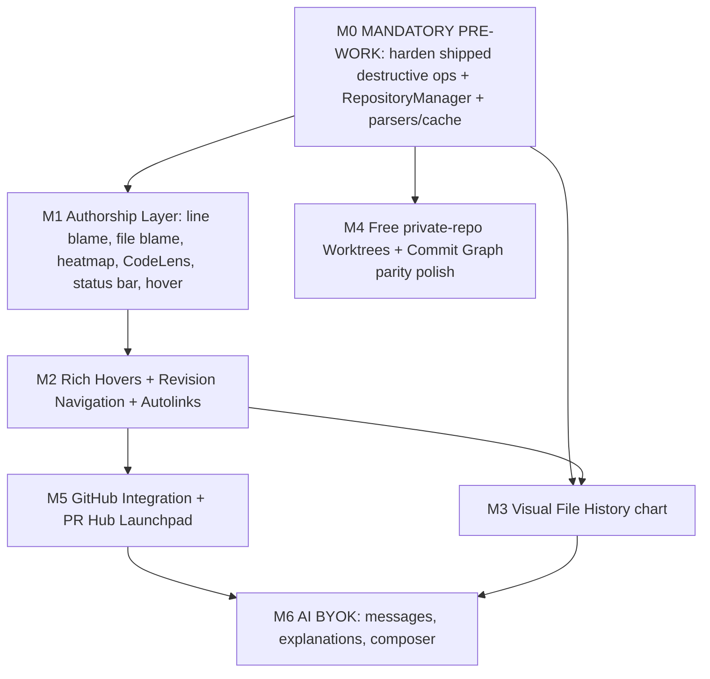

<!--
Implementation milestone plan for bringing GitLens-class features to IntelliGit
(this VS Code extension). For each feature it documents how GitLens implements
it, how we will implement it on top of the existing IntelliGit architecture, the
exact git commands and VS Code APIs involved, the extension-host <-> webview data
flow, edge cases, effort, and risk. Companion to gitlens-feature-analysis.md.
This is a planning artifact; it does not change code.
-->

# IntelliGit — GitLens Feature Implementation Plan (Product Milestones)

> Companion to [`gitlens-feature-analysis.md`](./gitlens-feature-analysis.md).
> That doc says **what** to build and what GitLens charges for. This doc says
> **how** — GitLens's approach vs. ours, milestone by milestone, in full detail.
>
> **Positioning (DECIDED): IntelliGit is not "cheaper GitLens."** The wedge is
> **"JetBrains-style Git for VS Code — free for private repos, safer history
> editing, no forced Git SaaS account."** This repo already has a JetBrains-style
> commit panel, shelf workflow, merge-conflict editor, and commit graph — a more
> defensible identity than a GitLens parity checklist. The
> [`gitlens-feature-analysis.md`](./gitlens-feature-analysis.md) doc is **competitive
> intelligence**, not the product blueprint. We selectively beat GitLens on a few
> high-value axes (free private-repo graph/worktrees, reversible destructive ops,
> account-free auth) rather than cloning its full surface shallowly.
>
> **Strategy: features are the moat, win adoption first.** Ship the high-value
> capability free; monetization comes later via an **open-core split** (§10), not
> a local-feature paywall. Milestones are ordered for the best engineering
> sequence and fastest trustworthy value.
>
> **Critical correction (post-review):** destructive history-rewriting operations
> **already ship today** (`src/commands/commitCommands.ts` — `reset --hard`,
> `drop`, `squash`, `undo`, interactive rebase). They are therefore **not** future
> work; hardening them is **urgent M0**, before any new feature. See M0.

---

## 0. Platform Reality (read this first)

This repo is a **VS Code extension** — _IntelliGit_ (`package.json`:
`"engines": { "vscode": "^1.96.0" }`, `"main": "./dist/extension.js"`, category
`SCM Providers`). It is **not** an Electron app. The "Electron" signal came from
`@vscode/test-electron` (the test harness) and the fact that VS Code itself runs
on Electron. The UI is **React 18 + Chakra UI rendered inside VS Code webviews**,
bundled with **esbuild**. Git access is via **`simple-git`** (which shells out to
the system `git` binary — consistent with the "shell out to git CLI" decision).

Everything below builds **on the existing IntelliGit codebase**, reusing its
patterns rather than introducing a parallel stack.

### 0.1 Existing architecture (verified, with file references)

```
src/
├── extension.ts                 # Entry point. THE extension host is the sole
│                                # data coordinator — views never talk directly.
├── types.ts                     # Shared domain types (Branch, etc.)
├── git/
│   ├── executor.ts              # GitExecutor: wraps simpleGit(repoRoot).raw(args)
│   │                            #   maxConcurrentProcesses: 6
│   └── operations.ts            # GitOps (1104 LOC): the git operations layer
│                                #   getLog, getCommitDetail, getStatus, stage/
│                                #   unstage, commit, push, pullRebase, shelve*,
│                                #   getFileHistory, getFileHistoryEntries,
│                                #   getFileContentAtRef, getBranches, ...
├── services/                    # cloneService, diffService, gitHelpers,
│                                # jetbrainsMergeService, publishService,
│                                # refreshService, repositoryDiscovery
├── views/                       # WebviewViewProviders + tree providers:
│                                #   CommitGraphViewProvider, CommitInfoViewProvider,
│                                #   CommitPanelViewProvider, UndockedViewProvider,
│                                #   MergeConflict*, Onboarding, webviewHtml.ts
├── webviews/react/              # React 18 + Chakra UI apps (esbuild bundles):
│                                #   CommitGraphApp, CommitInfoApp, CommitList,
│                                #   commit-panel, merge-editor, undocked, shared
├── commands/                    # branchCommands, commitCommands
├── mergeEditor/                 # JetBrains-style 3-way merge editor
└── utils/                       # errors, fileOps, notifications
```

**Webview ↔ host messaging pattern (the contract we extend everywhere):**

- Host → webview: `webviewView.webview.postMessage(msg)`
- Webview → host: `webview.onDidReceiveMessage(async (msg) => …)`
- Messages are **typed** (e.g. `CommitGraphOutbound` in
  `webviews/react/commitGraphTypes.ts`). Webview acquires the API via
  `acquireVsCodeApi()`.
- **Invariant:** the extension host owns all git state; webviews are pure
  view/dispatch. Preserve this for every new feature.

### 0.2 Capability gap — have vs. need

| Capability                      | IntelliGit today                  | GitLens            | Action                |
| ------------------------------- | --------------------------------- | ------------------ | --------------------- |
| Commit Graph                    | ✅ Have (React webview)           | ✅                 | Polish to parity      |
| Commit details view             | ✅ Have                           | ✅                 | Reuse                 |
| Staging / commit panel          | ✅ Have                           | partial (uses SCM) | Reuse                 |
| Stash / shelf                   | ✅ Have (`shelve*`)               | ✅                 | Reuse                 |
| File history (data)             | ✅ Have (`getFileHistoryEntries`) | ✅                 | Build chart on top    |
| 3-way merge editor              | ✅ Have (JetBrains-style)         | partial            | Differentiator — keep |
| **Inline/line blame**           | ❌ **None**                       | ✅ signature       | **M1 — build**        |
| **Git CodeLens**                | ❌ None                           | ✅                 | **M1 — build**        |
| **Status-bar blame**            | ❌ None                           | ✅                 | **M1 — build**        |
| **File blame + heatmap**        | ❌ None                           | ✅                 | **M1 — build**        |
| **Hovers (details/changes)**    | ❌ None                           | ✅                 | **M2 — build**        |
| **Revision navigation cmds**    | ❌ None                           | ✅                 | **M2 — build**        |
| **Visual File History (chart)** | ❌ None                           | ✅ Pro             | **M3 — build**        |
| **Worktrees**                   | ❌ None                           | ✅ Pro-gated       | **M4 — build**        |
| **Remote/PR integration**       | ❌ None                           | ✅ Pro             | **M5 — build**        |
| **Launchpad (PR hub)**          | ❌ None                           | ✅ Pro             | **M5 — build**        |
| **AI (BYOK)**                   | ❌ None                           | ✅ Pro             | **M6 — build**        |
| **Autolinks / terminal links**  | ❌ None                           | ✅                 | **M2/M5 — build**     |

**Conclusion:** The graph half of GitLens already exists. The **in-editor
authorship layer** (blame/CodeLens/hover/heatmap) — GitLens's single most
recognizable hook — is entirely missing and is therefore Milestone 1.

---

## 1. Guiding Principles for All Milestones

1. **Extension host is the sole git coordinator.** All git runs in the host via
   `GitExecutor`; webviews never spawn git. New capability goes in **focused
   services** (`BlameService`, `WorktreeService`, …), **not** by growing the
   already-1104-LOC `GitOps` — freeze `GitOps`, see M0.3.
2. **One git access path.** Commands run through `GitExecutor.run(args)`
   (`simple-git` `raw`). Note `raw` does not stream — add a narrow, cancellable
   `child_process.spawn` path only where measured (see §7.2, M0.4). Never
   introduce a second git library.
3. **Immutability.** Data passed to webviews is built as new objects; never
   mutate cached entries in place (cache returns frozen copies). Aligns with repo
   coding-style rules.
4. **Typed message contracts.** Every new webview gets an `*Inbound` /
   `*Outbound` type union, mirroring `commitGraphTypes.ts`.
5. **Many small files.** New providers/services each in their own file
   (`ClassName` → `class_name.ts` is the global rule, but match the repo's actual
   PascalCase file convention for providers, e.g. `BlameController.ts`).
6. **Settings-first.** Every annotation/feature is toggleable and themable via
   `contributes.configuration`, matching GitLens's customization depth (§7.4).
7. **Test from the spec.** Parsers (blame, log) get adversarial unit tests via
   vitest against fixture output, written from git's documented format — not by
   mirroring the parser. Never mock git output we haven't seen real samples of.
8. **Graceful degradation.** Missing git binary, detached HEAD, uncommitted file,
   shallow clone, submodule, huge file — each feature defines explicit fallback.

---

## 2. Milestone Roadmap (ordering rationale)



**Why this order (revised after review):**

- **M0 is mandatory and first** — not an optional precursor. It (a) hardens
  destructive ops that **already ship** (urgent safety), (b) adds the
  `RepositoryManager` that per-document blame/CodeLens require, and (c) builds the
  parser/cache substrate every later milestone reuses. No new feature ships before
  M0.
- **M1 (authorship layer)** is GitLens's adoption hook and IntelliGit's biggest
  gap. Ship the *smallest* hook first — current-line blame, status-bar blame,
  rich hover — before the full settings UI.
- **M2 (hovers/navigation)** extends M1's blame data — cheap once M1 exists.
- **M3 (Visual File History)** can run in parallel with M2 (needs only M0
  log/file-history data, not blame).
- **M4 (free private-repo worktrees + graph polish)** is the clean undercut of
  GitLens's private-repo gate; reuses existing graph code.
- **M5 (GitHub integration/Launchpad)** needs network + auth; self-contained
  vertical depending only on M2's autolink parsing for hover enrichment.
- **M6 (AI)** last — builds on a stable commit/diff/branch surface; BYOK/VS Code
  LM is sensible but is **not** the main wedge.

Each milestone is independently shippable and user-visible.

---

## M0 — Mandatory Pre-Work: Harden + Foundation

**Not an optional precursor.** This is the first milestone and blocks all
features. It has three jobs: (1) harden destructive operations that **already
ship**, (2) replace the single-repo model with a `RepositoryManager`, (3) build
the parser/cache substrate.

### M0.1 Harden the destructive ops that already ship (URGENT)

**Current state (verified):** `src/commands/commitCommands.ts` already performs
history rewrites — `resetCurrentToHere` → `git reset --hard` (`:131`),
`dropCommit` → `rebase --onto` (`:555`), `squashCommits` → `reset --soft` +
commit (`:501`), `undoCommit` → `reset --soft` (`:340`), reword +
`interactiveRebaseFromHere` via terminal. Existing guards are real but uneven:
modal confirms everywhere; `undo`/`edit`/`squash`/`drop`/`rebase` are gated to
**unpushed commits only** with merge-commit guards and ancestry checks; squash has
a manual rollback (`:511`). **Gaps to close:**

- **`resetCurrentToHere` is the dangerous outlier — fix first.** It runs
  `reset --hard` and is **NOT** gated to unpushed; it will rewrite a *pushed*
  branch and silently discard uncommitted changes behind a single modal. Gate it
  (warn explicitly when the target is published) and route it through the backup-ref
  net below.
- **Auto backup ref before every history rewrite.** Before reset/drop/squash/
  amend-rewrite, create `refs/intelligit/backup/<branch>/<unix-ts>` at the
  pre-op `HEAD`. Post-op toast offers one-click **Undo** (`reset --hard <backup>`).
  This generalizes squash's ad-hoc rollback to all ops and is a core
  differentiator: destructive actions are always reversible.
- **Clean-tree precondition** consistently (squash already does this; apply to
  reset-hard and drop, with an offer to auto-shelve).
- **Backup-ref retention** setting `intelligit.graph.backupRetention` (keep last
  N per branch); prune on a schedule.

This subsection has **no UI dependency** and should land before any new feature.

### M0.2 `RepositoryManager` (replace the single selected-repo model)

**Current state (verified):** the extension binds one `executor`/`gitOps` to a
single selected `repoRoot` (`src/extension.ts:332-333`) and switches repos by
**mutating** it via `executor.setRoot()` (`:433`). Editor-wide blame/CodeLens
must resolve the repo **per document**, so blaming a file from repo B while repo
A is "selected" would target the wrong root.

- **Design:** `RepositoryManager` holding a `Map<repoRoot, { executor, gitOps }>`,
  lazily created. `getForDocument(uri): RepoContext` resolves a document's repo
  via `repositoryDiscovery`/`getRepositoryRoot` (cached). The graph view keeps a
  notion of "active repo" for its own UI, but **editor features always resolve
  per document**, never the active-repo singleton.
- **Kill the `setRoot` mutation** — switching repos selects a different cached
  context (immutability principle), it does not mutate a shared executor.
- Handle multi-root workspaces and files outside any repo (features no-op cleanly).

### M0.3 Git read services + pure parsers (do NOT grow `GitOps`)

**Current state (verified):** `src/git/operations.ts` is already **1104 LOC** —
the central operation bucket. The earlier draft of this doc said "GitService
facade" then "add methods to `GitOps`," which is contradictory. **Resolved:**
freeze `GitOps`; add **focused, single-responsibility services** plus **pure
parsers** that are unit-tested from fixtures.

- `BlameService.getBlame(repoCtx, filePath, range?, ref?)` → uses `GitExecutor`.
- `CommitMetaService.get(repoCtx, sha)`.
- Pure parsers in their own files: `parseBlamePorcelain.ts`, `parseLog.ts`,
  `parseNumstat.ts`, `parseWorktreeList.ts` — each tested against captured real
  git output (never mock invented output; never mirror the parser in assertions).
- **git commands:**
    - Blame: `git blame --line-porcelain -L <a>,<b> -- <file>` for ranged blame
      (one process per range, cached). See M0.4 on the streaming caveat.
    - Commit meta: use record/unit separators —
      `git show -s --format=%x1e%H%x1f%an%x1f%ae%x1f%aI%x1f%cI%x1f%P%x1f%s%x1f%b <sha>`
      (collision-proof against arbitrary message content).
- **Edge cases:** uncommitted lines (`0000000…` sha → "You, uncommitted"),
  renamed files (`--follow`), file not in ref, binary file (skip blame),
  CRLF, submodule paths.

### M0.4 Caching + the streaming caveat (corrected perf claim)

- **Caches:** `CommitMetaCache` (LRU by sha) and per-document `BlameCache` keyed
  `repoRoot::filePath::contentVersion`. Invalidate on
  `onDidSaveTextDocument`, `RefreshService` git-state events, and a `.git/**`
  FS watcher. Cache stores frozen objects; readers get copies.
- **Streaming caveat (corrected):** `GitExecutor` uses `simpleGit.raw()`
  (`src/git/executor.ts:13`), which **resolves only after the git process exits**
  — there is **no streaming/first-paint** with it. The earlier "<300 ms first
  paint via `--incremental`" claim is only achievable by adding a **narrow,
  cancellable spawned-process path** (`child_process.spawn`, parse
  `--incremental` lines as they arrive) separate from `simple-git`. **Decision:**
  for M1, rely on caching + ranged porcelain blame of the *visible* range only
  (fast enough); defer the streaming spawn path until measured need on very large
  files. Do not promise streaming we don't have.

**Acceptance:** destructive ops always create a recoverable backup ref + offer
undo; `resetCurrentToHere` no longer silently nukes a pushed branch; per-document
repo resolution is correct in a multi-root workspace; ranged blame on a visible
viewport returns < 100 ms warm, cache hit < 5 ms; parsers pass adversarial
fixtures.

**Effort:** M0.1 S–M, M0.2 M, M0.3 M, M0.4 M. **Risk:** Med — blame/log parsing
correctness and backup-ref edge cases (detached HEAD, no prior HEAD).

---

## M1 — Authorship Layer (the GitLens hook)

The cluster of features people install GitLens for. All free in GitLens; all
missing in IntelliGit.

### M1.1 Current-Line Blame (inline end-of-line annotation)

**What GitLens does:** subtle dimmed text at the end of the cursor's line —
`"You, 3 days ago • Fixed null check"`. Updates on cursor move; clears while
typing; configurable format tokens.

**How we'd do it:**

- VS Code API: `vscode.window.createTextEditorDecorationType({ after: { … } })`
  with an `after` `ThemableDecorationAttachment` (the trailing annotation).
- Listen to `window.onDidChangeTextEditorSelection` (debounced ~250 ms) and
  `onDidChangeActiveTextEditor`.
- Resolve current line → `BlameService.getBlame` (ranged blame for one line, via
  the M0 cache) → format string → `setDecorations(type, [range])`.
- Hide during multi-cursor / non-empty selection / dirty-line edits.
- Color: `gitlens`-style theme color via `ThemeColor("intelligit.trailingLineForeground")`.

**Format tokens (settings):** `${author}`, `${agoOrDate}`, `${message}`,
`${commit}` → `intelligit.currentLine.format`. Mirror GitLens token names for
familiarity.

**Edge cases:** uncommitted line → "You, uncommitted"; line beyond file (blank
new line) → no annotation; very long messages → truncate with ellipsis;
notebooks/diff editors → suppress.

**Effort:** M. **Risk:** Low–Med (debounce/flicker tuning).

### M1.2 File Blame (full-file annotation overlay)

**What GitLens does:** toggle to show per-line gutter annotation (sha, author,
date) for the whole file, with an **age heatmap** stripe.

**How we'd do it:**

- One `TextEditorDecorationType` with `before` attachments for the gutter column
  (sha+author+date), applied to every line range from full-file blame.
- Toggle command `intelligit.toggleFileBlame` (keybinding `Alt+B` to match
  GitLens muscle memory) maintaining per-editor on/off state.
- Reuse M0 full-file blame; group consecutive same-sha lines so only the first
  line of a block shows text (GitLens behavior) → less visual noise.

**Edge cases:** scrolling perf (apply decorations for whole file once, not on
scroll); editor split views (decorations are per-editor); re-blame on save.

**Effort:** M. **Risk:** Med (rendering density/perf).

### M1.3 File Heatmap (age stripe)

**What GitLens does:** colored bar on the edge — hot (recent) → cold (old) per
line based on commit age.

**How we'd do it:**

- `DecorationRenderOptions.overviewRulerColor` + a thin `before`/`gutterIcon`
  color stripe. Map each line's commit age to a color ramp (configurable
  hot/cold colors; default GitLens-like).
- Age computed from blame commit date relative to now; bucket into N steps to
  limit distinct decoration types (VS Code perf: reuse a fixed palette of
  decoration types, not one per line).

**Edge cases:** single-commit repo (all same color); future-dated commits (clamp).

**Effort:** S–M. **Risk:** Low.

### M1.4 Git CodeLens (above blocks/file)

**What GitLens does:** CodeLens line above the file top and above functions/
classes: `"<author>, <date> • N authors, M commits"`; click → quick-pick of
commit actions.

**How we'd do it:**

- Implement `vscode.languages.registerCodeLensProvider({ scheme: 'file' }, provider)`.
- `provideCodeLenses`: for file-level lens, range = line 0; for block-level, use
  `vscode.commands.executeCommand('vscode.executeDocumentSymbolProvider', uri)`
  to get symbol ranges (functions/classes), then attach a lens at each symbol's
  start line.
- `resolveCodeLens`: compute recent-author + author/commit counts for that range
  via range blame (lazy resolve = cheap; only visible lenses resolve).
- Command on click → reuse existing commit quick-pick / open commit details view.
- Toggle `intelligit.toggleCodeLens` (`Shift+Alt+B`).

**Edge cases:** languages without a symbol provider → file-level lens only;
performance on huge files → cap symbols, resolve lazily.

**Effort:** M. **Risk:** Med (symbol-provider dependency + perf).

### M1.5 Status-Bar Blame

**What GitLens does:** status-bar item with current-line author/date; click →
commit actions quick-pick.

**How we'd do it:**

- `vscode.window.createStatusBarItem(StatusBarAlignment.Left, priority)`.
- Update on the same selection-change listener as M1.1 (share the resolved blame
  to avoid double work).
- `command` → quick-pick with: Open Commit Details, Copy SHA, Open Changes,
  Show File History (wire to existing commit-info view + M3 once present).

**Edge cases:** no repo / no blame → hide item; share debounce with M1.1.

**Effort:** S. **Risk:** Low.

### M1 cross-cutting

- **Shared selection pipeline:** one debounced selection-change handler computes
  line blame once and fans out to current-line annotation (M1.1) + status bar
  (M1.5). Avoid N independent listeners.
- **Settings group** `intelligit.blame.*`, `intelligit.codeLens.*`,
  `intelligit.heatmap.*`.
- **Interactive Settings Editor — shell lands here (DECIDED: incremental).** The
  settings webview (the GitLens moat) is built incrementally: M1 ships the
  **shell** — a `SettingsViewProvider` React webview with a section registry,
  live preview, and write-through to `workspace.getConfiguration().update(...)` —
  populated initially with the blame/CodeLens/heatmap sections. Every later
  milestone **registers its own section** as features land, so the GUI never lags
  the feature set. See §7.4 for the architecture.

**M1 acceptance:** open any file in a repo → see line blame, can toggle file
blame + heatmap, CodeLens shows above symbols, status bar shows current-line
author; all respect theme; toggling is instant; no perceptible typing lag.

**M1 effort:** L (the milestone that establishes the whole annotation system).
**M1 risk:** Med — perf and flicker are the main hazards; mitigated by M0 cache

- shared pipeline + lazy CodeLens resolve.

---

## M2 — Hovers, Revision Navigation, Autolinks

Depends on M1 blame data.

### M2.1 Details Hover & Changes Hover

**What GitLens does:** hovering a line shows a rich Markdown card — commit
message, author+avatar, date, changed files, and quick-action links; a second
"changes" hover shows the previous version of that line (inline diff).

**How we'd do it:**

- `vscode.languages.registerHoverProvider({ scheme: 'file' }, provider)`.
- `provideHover(doc, position)`: resolve line blame (M0) → build a
  `vscode.MarkdownString` (set `.isTrusted = true` for command links). Include
  `command:` URIs to existing actions (open commit details, open changes,
  copy sha) — use `encodeURIComponent(JSON.stringify(args))`.
- **Changes hover:** diff the line's current text against its text in the parent
  commit (`git show <parent>:<path>` via `getFileContentAtRef`, then line-map);
  render as a fenced diff block in the same MarkdownString.
- Avatars: `>?s=20)` when an
  email is available and network/integration allows (M5 enriches this).

**Edge cases:** uncommitted line → "uncommitted" card, no parent diff; markdown
injection from commit messages → escape; hover spam → VS Code throttles, but
cache the rendered string per (sha,line).

**Effort:** M. **Risk:** Low–Med.

### M2.2 Revision Navigation commands

**What GitLens does:** step a file through its history; diff against previous/
next revision, working file, branch/tag.

**How we'd do it:** new commands reusing existing `diffService` +
`getFileHistoryEntries` + `getFileContentAtRef`:

- `intelligit.openChangesWithPreviousRevision`
- `intelligit.openChangesWithNextRevision`
- `intelligit.openChangesWithWorkingFile`
- `intelligit.openChangesWithBranchOrTag` (quick-pick refs from `getBranches` +
  tags)
- Implementation: build two `vscode.Uri`s with a custom `intelligit-git:` scheme
  backed by a `TextDocumentContentProvider` that returns
  `getFileContentAtRef(path, ref)`, then `vscode.commands.executeCommand(
'vscode.diff', leftUri, rightUri, title)`. (Reuse
  `registerReadonlyDiffContentProvider` already present in `diffService`.)
- Maintain a per-file "current revision pointer" so prev/next walk the history
  list returned by `getFileHistoryEntries`.

**Edge cases:** first/last revision (disable step), renamed file across history
(`--follow`), working file dirty (label clearly).

**Effort:** M. **Risk:** Low — leverages existing diff plumbing.

### M2.3 Autolinks + Terminal Links

**What GitLens does:** turn issue refs (`#123`, `JIRA-45`) in commit messages
into clickable links; clickable refs/SHAs in the integrated terminal.

**How we'd do it:**

- Autolinks: a pure function `linkifyMessage(text, autolinkRules)` →
  `MarkdownString` with `[match](url)`. Rules from settings
  `intelligit.autolinks` (array of `{ prefix, url }`, `<num>` token), plus
  built-in GitHub `#<n>` when a GitHub remote is detected. Used by hovers (M2.1),
  commit details view, and graph tooltips.
- Terminal links: `vscode.window.registerTerminalLinkProvider` — regex-match
  40/7-hex SHAs and branch/tag names in terminal output; on click → open commit
  details / reveal in graph.

**Edge cases:** ambiguous short SHAs (verify with `git rev-parse --verify`);
overlapping autolink rules (longest-prefix wins); avoid false positives on hex
that isn't a sha (`git cat-file -t`).

**Effort:** M. **Risk:** Low.

**M2 acceptance:** hover any line → rich card with working command links and a
previous-version diff; revision-nav commands diff correctly across history;
issue refs and terminal SHAs are clickable.

**M2 effort:** M. **Risk:** Low–Med.

---

## M3 — Visual File History (timeline chart)

GitLens Pro feature; we ship it free. Depends only on M0 log/file-history data.

**What GitLens does:** a webview chart — X = time, Y = contributors (swim lanes),
bubbles per commit colored by author and sized by change magnitude, with
addition/deletion bars; hover → commit detail.

**How we'd do it (new React webview, mirrors existing graph webview wiring):**

- **Data (host):** extend `getFileHistoryEntries` to also return per-commit
  `additions`/`deletions` and author identity. git command:
  `git log --follow --numstat --date=iso-strict
 --format=%x1f%H%x1f%an%x1f%ae%x1f%aI -- <file>` then parse numstat blocks
  keyed by the `%x1f`-delimited header. (Use `\x1f` unit-separator to avoid
  delimiter collisions in messages — this is the safe parsing approach for all
  log parsers; apply repo-wide.)
- **View:** new `VisualFileHistoryViewProvider` (WebviewViewProvider) +
  `webviews/react/visual-file-history/` React app. Reuse `webviewHtml.ts` CSP/
  nonce scaffolding and the `*Inbound/*Outbound` message pattern.
- **Rendering — DECIDED: D3-math + React-SVG.** Import only the D3 submodules
  needed for math (`d3-scale` for `scaleTime`/`scaleBand`, `d3-shape` if needed);
  **React owns the SVG DOM** (no imperative D3 selection, no React/D3 conflict).
  This keeps the webview bundle small (submodule imports, not the `d3`
  meta-package) while reusing battle-tested scales. Bubbles = `<circle>`;
  size = `sqrt(adds+dels)` scaled; color = deterministic `hash(author email)` →
  palette. (Rejected: hand-rolled SVG — too much reinvented scale/axis code;
  all-in-one chart libs like Recharts/Chart.js — wrong chart type for swim-lane +
  bubble + add/del bars. `visx` is an acceptable fallback if React-component
  ergonomics are wanted, but plain `d3-scale` + React is the smaller-bundle pick.)
  ```tsx
  import { scaleTime, scaleBand } from 'd3-scale';
  const x = scaleTime().domain([minDate, maxDate]).range([0, width]);
  const y = scaleBand().domain(authors).range([0, height]);
  // React renders; D3 only computes positions:
  // <circle cx={x(c.date)} cy={y(c.author)} r={radius(c.changes)} fill={color(c.author)} />
  ```
- **Interaction:** click bubble → post `{type:'openCommit', sha}` → host opens
  existing `CommitInfoViewProvider`. Hover → tooltip with M2.1-style card data.
- **Entry points:** command `intelligit.showVisualFileHistory`, editor title
  menu, and from M1.5 status-bar quick-pick.

**Edge cases:** files with hundreds of commits (virtualize / cap + "load more");
binary files (numstat shows `-` → show count-only, no add/del bars); merged
renames; single-author files (legend still shown).

**Effort:** L (new webview + chart). **Risk:** Med — charting + large-history
perf. Mitigate with a render cap and incremental load.

---

## M4 — Free Private-Repo Worktrees + Commit Graph Parity Polish

Independent; reuses existing graph code.

### M4.1 Worktrees

**What GitLens does:** create/list/open/remove git worktrees from a side-bar
view; open a worktree in a new/current window; tie a worktree to a branch/PR.

**How we'd do it:**

- **`WorktreeService`** (focused service, not added to the frozen `GitOps`; uses
  `GitExecutor` + a pure `parseWorktreeList.ts`):
    - `list()` → `git worktree list --porcelain` (parse `worktree`/`HEAD`/
      `branch`/`bare`/`detached` records).
    - `add(path, ref, {newBranch?})` → `git worktree add <path> <ref>` /
      `git worktree add -b <branch> <path> <start>`.
    - `remove(path, {force?})` → `git worktree remove`.
    - `prune()` → `git worktree prune`.
- **Positioning:** this is offered **free on private repos** — the clean undercut
  of GitLens's private-repo gate; worktrees are pure local plumbing with no reason
  to gate.
- **View:** a `WorktreesViewProvider` — given the repo is graph-heavy, a tree view
  (`vscode.window.createTreeView`) is lighter than a webview here and matches VS
  Code idioms; each node has context actions (open, open in new window, remove,
  copy path).
- **Open:** `vscode.commands.executeCommand('vscode.openFolder', Uri.file(path),
{ forceNewWindow })`.

**Edge cases:** worktree on a checked-out branch (git forbids — surface error);
locked/prunable worktrees; relative paths; default new-worktree location setting.

**Effort:** M. **Risk:** Low–Med.

### M4.2 Commit Graph parity polish (graph already exists → close gaps)

**Reality check:** the destructive graph ops are **already implemented and
shipping** (`commitCommands.ts`: reset/drop/squash/undo/rebase). There is no
"Phase 1 = no history rewrite yet" — that work is done. So M4.2 is **not** about
introducing destructive ops; it is about:

1. **Wiring the M0.1 hardening into the graph context menu** — every existing
   destructive action now goes through the auto backup-ref + Undo-toast +
   command-preview confirmation built in M0. (The safety net itself is built in
   M0, not here.)
2. **Confirmation UX upgrade** for the already-shipping ops: replace the plain
   modal with one that shows the **exact git command** + **list of affected
   commits** (sha + summary), enforces the **clean-tree precondition** uniformly,
   surfaces the **backup-ref name** so the user sees the undo path, and adds
   **force-push double-confirm** (`--force-with-lease`) if/when force-push is
   added.
3. **Remaining graph feature gaps** (genuinely new):
   - Prefixed search (`author:`, `message:`, `file:`, `@me`) — parse in host,
     filter the log query / client-side.
   - New ops not yet present: `rebaseOnto` (UI), `forcePushWithLease` — added
     behind the M0 backup-ref + confirmation flow.
   - Column show/hide + reorder persistence (`workspaceState`).
   - Minimap / scroll markers (defer; experimental).

**Effort:** M (incremental — most mutation logic exists; this is hardening +
search + columns). **Risk:** Low once M0.1 backup refs are in place.

---

## M5 — Remote Integrations + PR Hub (Launchpad)

Self-contained vertical; needs network + auth. Depends on M2 autolinks for hover
enrichment.

### M5.1 Provider integration layer

**What GitLens does:** connect GitHub/GitLab/Bitbucket/Azure; enrich hovers with
PR/issue data + avatars; associate PRs with branches/commits.

**How we'd do it (DECIDED: GitHub first, GitLab in a follow-up):** ship and polish
the `GitHubProvider` + Launchpad end-to-end first; the `RemoteProvider` interface
below is designed so GitLab/others drop in later without touching consumers.

- **Auth:** prefer `vscode.authentication.getSession('github', scopes)` — VS Code
  ships a built-in GitHub auth provider, so we get OAuth for free (no GitKraken
  account needed — a genuine UX win over GitLens). GitLab/others (later): PAT
  stored via `context.secrets` (`SecretStorage`).
- **Provider interface (composition, not inheritance):**
    ```ts
    interface RemoteProvider {
        getPullRequests(filter): Promise<PullRequest[]>;
        getPullRequestForBranch(branch): Promise<PullRequest | undefined>;
        getIssue(id): Promise<Issue | undefined>;
    }
    ```
    Implementations: `GitHubProvider` (REST/GraphQL via `fetch`),
    `GitLabProvider`, etc. Remote detected from `getRemotes()` URL parsing.
- Enrich M2.1 hovers + autolinks with live PR/issue titles + avatars (cache with
  TTL; respect rate limits).

**Security:** tokens only in `SecretStorage`; never log; scope-minimal; redact in
errors (repo security rule).

### M5.2 Launchpad (PR hub)

**What GitLens does:** PRs grouped by status (Ready to merge / Blocked / Needs
your review / Waiting / Draft / Snoozed); pin/snooze; open/merge/checkout.

**How we'd do it:**

- New React webview `launchpad/` (reuse webview scaffolding). Host fetches via
  `RemoteProvider.getPullRequests`, computes the status grouping from PR review
  state + CI checks + mergeable flag.
- Actions post to host: open in browser (`env.openExternal`), checkout branch
  (`GitOps` fetch + checkout), merge (provider API).
- Snooze/pin persisted in `workspaceState`/`globalState`.
- Entry: activity-bar view + status-bar item (PR count for current branch).

**Edge cases:** rate limiting (backoff + cache + manual refresh); 2FA/SSO orgs;
no network (show cached + offline state); forks/cross-repo PRs.

**Effort:** L (auth + two providers + webview). **Risk:** Med–High (external APIs,
auth, rate limits). Ship GitHub first; GitLab next; others later.

---

## M6 — AI (BYOK)

Last, builds on stable commit/diff/branch surface. **BYOK only** — user supplies
their own provider key; we carry zero inference cost.

**What GitLens does:** AI commit messages, stash descriptions, commit
explanations, changelog, and an interactive Commit Composer; tokens bundled into
the subscription (GitKraken AI / Copilot / BYOK).

**How we'd do it:**

- **Provider abstraction (composition):**
    ```ts
    interface AIProvider {
        complete(prompt: AIPrompt): Promise<string>;
    }
    ```
    **DECIDED — default to `VSCodeLMProvider` (`vscode.lm.selectChatModels()`)**:
    VS Code's Language Model API uses the user's Copilot subscription with **no
    key and no cost to us** — this is the default, zero-config path. Direct
    `AnthropicProvider` / `OpenAIProvider` (keys in `SecretStorage`) are the
    **advanced** opt-in path for users without Copilot or who want a specific
    model. BYOK only — we never resell inference.
- **Features (each = build prompt from existing data → call provider → present):**
    - _Commit message_: diff of staged changes (`git diff --staged`) → prompt →
      prefill the existing commit panel input. Command in commit panel toolbar.
    - _Stash description_: diff of working changes → prompt → prefill shelve dialog.
    - _Commit explanation_: `getCommitDetail` diff → prompt → render in
      `CommitInfoView` as a Markdown "Explain" section.
    - _Changelog_: multi-commit selection in graph → prompt → new document.
    - _Commit Composer (stretch)_: propose a logical split of working changes into
      multiple commits (AI returns groupings of hunks); user reviews in a webview
      before applying via staged partial commits (`git apply --cached` of hunks).
      This is the most complex; spike separately.
- **Prompts** are templated + user-overridable (settings), mirroring GitLens's
  `generateCommitMessagePrompt`.

**Security/cost:** never send code to a provider without explicit opt-in +
clear provider/endpoint disclosure; show a one-time consent; redact secrets from
diffs before sending (scan for obvious key patterns).

**Edge cases:** no provider configured (graceful prompt to set one); large diffs
(truncate/summarize with a token budget); provider errors/timeouts (clear
fallback, never block the commit).

**Effort:** M (messages/explanations) + L (composer). **Risk:** Med — provider
variability; mitigated by the abstraction + VS Code LM default.

---

## 7. Cross-Cutting Concerns

### 7.1 Cache invalidation matrix

| Event                                           | Invalidate                              |
| ----------------------------------------------- | --------------------------------------- |
| `onDidSaveTextDocument`                         | that file's blame cache                 |
| commit / amend (via GitOps)                     | blame + log + commit-meta for repo      |
| branch switch / checkout                        | all per-file blame + graph              |
| pull / fetch / rebase / reset                   | full repo caches                        |
| `.git/**` FS watcher                            | debounce → repo caches                  |
| external edit (`onDidChangeTextDocument` dirty) | mark line-blame stale, re-blame on save |

Reuse/extend the existing `RefreshService` as the single event bus; do not add
parallel watchers per feature.

### 7.2 Performance (large repos)

- Blame only the **visible viewport range** first (ranged porcelain), then fill
  the rest lazily — `simpleGit.raw()` does not stream (see M0.4), so first paint
  comes from small ranged queries + cache, not from `--incremental`. A cancellable
  `child_process.spawn` `--incremental` path is a deferred optimization for very
  large files, not the baseline.
- Lazy CodeLens `resolveCodeLens` (only visible lenses compute).
- Fixed decoration-type palette (never one decoration type per line).
- Cap Visual File History to N commits with incremental load.
- `maxConcurrentProcesses: 6` already set in `GitExecutor`; add a queue for blame
  bursts so cursor-spam doesn't spawn dozens of `git blame`.
- Cancellation: pass `CancellationToken` through provider methods; abort
  in-flight blame when the active editor changes.

### 7.3 Parsing safety (applies to every git parser)

- Use `%x1f` (unit separator) + `%x1e` (record separator) in `--format` to make
  log/commit parsing collision-proof against arbitrary message content.
- Write vitest unit tests from **real captured fixtures** of git output, derived
  from git's documented format — never mock output we invented, never mirror the
  parser in the assertion (repo test-quality rule).
- Adversarial cases: empty repo, single commit, merge commits (multiple parents),
  unicode/emoji/RTL in messages, CRLF, renamed/copied files, binary numstat `-`.

### 7.4 Settings & customization — Interactive Settings Editor (the GitLens moat)

GitLens's interactive settings editor is a genuine moat (hundreds of options made
approachable via a GUI). **DECIDED: build it incrementally**, shell in M1, one
section added per milestone. Effort is not a constraint — sections can be
parallelized across subagents.

- **Raw config:** `contributes.configuration` groups — `intelligit.blame`,
  `intelligit.codeLens`, `intelligit.heatmap`, `intelligit.hovers`,
  `intelligit.autolinks`, `intelligit.integrations`, `intelligit.ai`,
  `intelligit.graph`. This is the source of truth; the GUI is a view over it.
- **Token-based format strings** for blame/hover (mirror GitLens token names to
  ease migration for switchers).
- **Architecture of the GUI (React webview, reuses existing scaffolding):**
  - `SettingsViewProvider` (WebviewViewProvider) + `webviews/react/settings/`.
  - **Section registry:** each feature contributes a `SettingsSection`
    descriptor (`{ id, title, fields[], previewComponent }`). M1 registers
    blame/CodeLens/heatmap; M2 hovers/autolinks; M3 visual-file-history; M4 graph;
    M5 integrations; M6 ai. The shell renders whatever is registered — so the GUI
    is always in sync with shipped features.
  - **Two-way binding:** read via `workspace.getConfiguration('intelligit')`;
    write via `.update(key, value, ConfigurationTarget.Global|Workspace)`; react
    to external changes via `onDidChangeConfiguration`.
  - **Live preview** pane per section (e.g. a sample line showing the current
    blame format string) — the part that makes it feel premium.
- **Subagent parallelization note:** once the shell + registry contract exist,
  each section is an independent, well-scoped unit suitable for a subagent to
  implement against the `SettingsSection` interface.

### 7.5 Commands, keybindings, menus

- Mirror GitLens default keybindings where unclaimed (`Alt+B` file blame,
  `Shift+Alt+B` CodeLens) to win muscle-memory switchers.
- Register editor title / context-menu contributions in `contributes.menus`.

### 7.6 Testing strategy

- **Unit (vitest):** all parsers (blame, log, worktree, numstat) from fixtures;
  autolink linkify; age→color bucketing; format-token rendering.
- **Integration (`@vscode/test-electron`):** decoration application, CodeLens
  provider output, hover content, diff-scheme content provider, command wiring,
  against a temp fixture repo created in `beforeEach`.
- **Manual matrix:** large monorepo, shallow clone, submodule, detached HEAD,
  multi-root workspace.
- Target 80%+ on new code; quality over coverage (repo rule).

### 7.7 Risks register

| Risk                                       | Likelihood | Impact   | Mitigation                                            |
| ------------------------------------------ | ---------- | -------- | ----------------------------------------------------- |
| **Already-shipping `reset --hard` data loss** | **High**   | **High** | **M0.1: gate to unpushed/warn, backup ref + Undo**    |
| Blame perf on huge files                   | Med        | High     | viewport-ranged blame, cache, queue, cancellation     |
| Decoration flicker/typing lag              | Med        | Med      | debounce, shared selection pipeline                   |
| Log/blame parse bugs on edge content       | Med        | High     | `%x1f`/`%x1e` delimiters, fixture tests               |
| Wrong-repo blame in multi-root workspace   | Med        | Med      | M0.2 `RepositoryManager`, per-document resolution     |
| External API rate limits (M5)              | High       | Med      | cache+TTL, backoff, manual refresh                    |
| Auth/secret handling (M5/M6)               | Med        | High     | SecretStorage, VS Code auth provider, redaction       |
| Open-source fork of paid features          | Med        | Med      | open-core split (§10) — paid code proprietary-licensed |
| AI cost creep                              | Low        | Med      | BYOK-only + VS Code LM default; no resold tokens      |

---

## 8. Sequencing Summary

0. **M0 — Mandatory pre-work (FIRST, blocking):** harden already-shipping
   destructive ops (backup refs + Undo; fix un-gated `reset --hard`), add
   `RepositoryManager`, build read services + fixture-tested parsers + caches.
1. **M1 — Authorship Layer** (the hook; smallest first: line blame + status bar +
   hover; settings-editor *shell* only).
2. **M2 — Hovers, Revision Navigation, Autolinks** (cheap once M1 exists).
3. **M3 — Visual File History** (parallelizable with M2; needs only M0 data).
4. **M4 — Free private-repo Worktrees + Graph parity polish** (the undercut;
   wires M0 hardening into the graph).
5. **M5 — GitHub Integration + Launchpad** (network/auth vertical; GitLab later).
6. **M6 — AI BYOK** (last; builds on a stable surface; not the main wedge).

**Recommended study order for engineers** (foundation-first):
`extension.ts` (esp. the single-repo `executor`/`setRoot` flow `:332`,`:433`) →
`git/executor.ts` → `git/operations.ts` → `commands/commitCommands.ts` (the
already-shipping destructive ops M0.1 must harden) → `services/refreshService.ts`
→ `views/CommitGraphViewProvider.ts` + `webviews/react/commitGraphTypes.ts`
(the messaging contract) → then this doc's M0 → M1.

---

## 9. Resolved Decisions

All open questions are resolved. Recorded here for traceability.

1. **M3 charting — RESOLVED: D3-math + React-SVG.** Import only `d3-scale`
   (+ `d3-shape` if needed) for math; React renders the SVG. Smallest bundle,
   no imperative/React conflict, full control of the swim-lane/bubble/add-del
   layout. `visx` is the acceptable fallback if React-component ergonomics are
   wanted. Rejected: hand-rolled (too much reinvented scale/axis code) and
   all-in-one chart libs (wrong chart type). See M3.
2. **Destructive ops — RESOLVED: harden the already-shipping ops in M0, not
   "later".** reset/drop/squash/undo/rebase already exist in
   `commitCommands.ts`. M0.1 (urgent, first) adds auto backup refs
   (`refs/intelligit/backup/<branch>/<ts>`) + one-click Undo, fixes the un-gated
   `reset --hard`, and enforces clean-tree preconditions uniformly. M4.2 then
   wires this net + command-preview confirmations into the graph context menu and
   adds the remaining ops (rebaseOnto UI, force-push-with-lease). See M0.1, M4.2.
3. **M5 provider scope — RESOLVED: GitHub first, GitLab later.** Ship the GitHub
   provider + Launchpad first using VS Code's built-in GitHub auth; add GitLab
   (PAT via SecretStorage) in a follow-up. See M5.
4. **M6 default AI path — RESOLVED: lead with VS Code LM API.** Default to
   `vscode.lm.selectChatModels()` (uses the user's Copilot, zero key, zero cost
   to us); direct Anthropic/OpenAI keys (SecretStorage) are the advanced path.
   BYOK only — we never resell inference. See M6.
5. **Interactive settings editor — RESOLVED: build it, incrementally.** It is the
   GitLens moat, so it's in scope; effort is not a constraint (sections can be
   parallelized across subagents). Shell lands in M1; each milestone registers
   its own section. See §7.4.

---

## 10. Licensing & Monetization Model (DECIDED: Open-Core)

**The problem (verified):** `package.json` declares `"license": "MIT"`. Under
MIT, any **local-only** paid feature can be legally forked and stripped of its
paywall. A pure "charge for a local feature" model is therefore not defensible.

**DECIDED — open-core split:**

- **Free core stays open (MIT):** the JetBrains-style UX, blame/authorship layer,
  commit graph, worktrees (incl. **private repos** — the deliberate undercut),
  visual file history, safer history editing. This is the moat-by-adoption.
- **Paid features live in a separate, proprietary-licensed module** — not under
  MIT — so they cannot be trivially forked. Candidates align with where value is
  hard to fork and/or carries real cost: **team Launchpad, self-hosted/enterprise
  providers, policy controls, SSO, cloud patch sharing, priority support.**
- **Repo structure implication:** before any paid feature is written, split the
  workspace so proprietary code is physically and license-wise separate (e.g. a
  `packages/` boundary with distinct `LICENSE`), and confirm the contribution/CLA
  story. **This decision blocks paywall work — resolve the split first.**

**Monetization is account/server/team-based, not local-feature-based.** This
matches the positioning: individuals get a generous free, account-free, local
product; teams/enterprises pay for collaboration, governance, and support. The
[`gitlens-feature-analysis.md`](./gitlens-feature-analysis.md) §17 monetization
levers still apply, re-scoped to this open-core boundary.

**Open items to confirm before building paid features:**

- Exact MIT-vs-proprietary file/package boundary and how the marketplace build
  bundles both.
- Whether a CLA is needed for outside contributions to the open core.
- License-key / entitlement check mechanism for the proprietary module (server
  validation, since client-side checks in shipped JS are bypassable).

---

## 11. Sources

- IntelliGit codebase — verified May 2026: `package.json` (`license: MIT`,
  `engines.vscode`), `src/extension.ts` (`:332-333` single executor, `:433`
  `setRoot` mutation), `src/git/executor.ts` (`:13` `simpleGit.raw`),
  `src/git/operations.ts` (1104 LOC), `src/commands/commitCommands.ts`
  (shipping `reset --hard`/drop/squash/undo/rebase), `src/views/*`,
  `src/webviews/react/*`.
- [`gitlens-feature-analysis.md`](./gitlens-feature-analysis.md) — feature/tier source of truth.
- [`gitlens-feature-analysis.md`](./gitlens-feature-analysis.md) — feature/tier source of truth.
- VS Code Extension API: decorations, CodeLens, Hover, TextDocumentContentProvider,
  TerminalLinkProvider, authentication, SecretStorage, Language Model API.
- git docs: `git-blame`, `git-log`, `git-worktree`, `git-show` (format specifiers).
