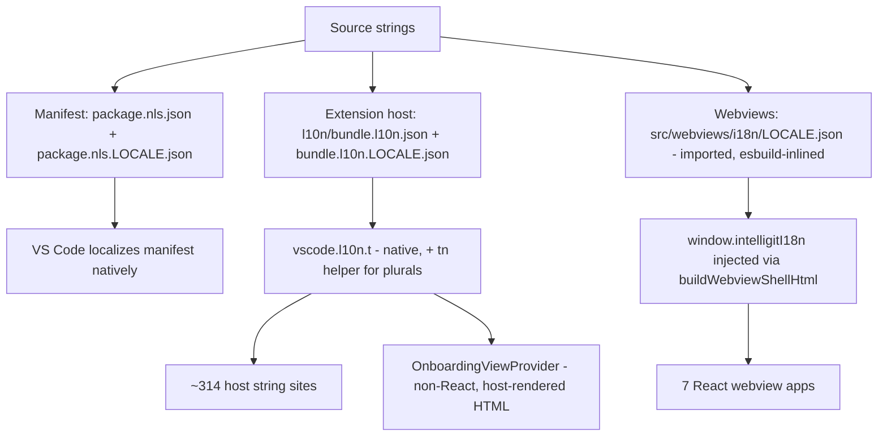

# Implementation Plan — Multilingual Support (i18n / l10n)

## Goal

Localize IntelliGit into the following languages while keeping all Git data
(branch names, commit messages, refs, raw output) untouched:

| Locale code | Language | Notes |
|-------------|----------|-------|
| `zh-cn` | Chinese (Simplified) | "Mandarin" maps here by default |
| `zh-tw` | Chinese (Traditional) | optional second Chinese variant |
| `ja` | Japanese | CJK width/line-height stress case |
| `ko` | Korean | CJK |
| `es` | Spanish | |
| `de` | German | longest strings — width stress case |
| `fr` | French | |
| `pt-br` | Portuguese (Brazil) | split from pt-pt for quality |
| `pt-pt` | Portuguese (Portugal) | |
| `ru` | Russian | complex plurals (one/few/many) |
| `pl` | Polish | complex plurals (one/few/many) |

English (`en`) is the source/fallback locale and is not a translation target.

## Key Decision (LOCKED): extension follows VS Code's display language

**Language model: pure-native.** There is **no in-extension language picker and
no `intelligit.language` setting.** The extension's locale is always VS Code's
display language (`vscode.env.language`) across all three surfaces.

To run IntelliGit in Spanish, the user sets VS Code's display language to
Spanish (Command Palette → "Configure Display Language", which installs the
Spanish language pack), or launches with `--locale=es`. This is the standard,
idiomatic behavior for VS Code extensions.

### Consequences of pure-native (vs the rejected picker model)

- **No setting, no locale resolver, no reload-on-change logic.** VS Code already
  triggers a reload when the user changes display language.
- **Manifest** (`package.nls.*`) and **extension host** (`vscode.l10n.t`) are
  localized natively by VS Code — no custom loader.
- **Webviews** still need a custom layer: `vscode.l10n.t` does not run in the
  browser context. The host injects the catalog for `vscode.env.language`.
- **Accepted tradeoff:** a user cannot view IntelliGit in Japanese while keeping
  VS Code's UI in English. If that is ever required, revisit the picker model
  (it adds a setting, a host resolver, reload logic, and a divergence from
  native l10n). Out of scope for this plan.

## Architecture Overview

Three string surfaces, all keyed to `vscode.env.language`:



### Surfaces (verified against current code)

- **Manifest** — `contributes.commands` has **39** commands (package.json), plus
  `viewsContainers`, `views`, `menus`, and `configuration` titles/descriptions.
- **Extension host** — ~314 string-bearing API call sites in `src/**/*.ts`.
- **Webviews** — **7** React bundles (`scripts/webviewConfigs.js`):
  CommitGraph, CompactCommitGraph, CommitPanel, CommitInfo, MergeEditor,
  MergeConflictSession, Undocked. **Plus** `OnboardingViewProvider`
  (src/views/OnboardingViewProvider.ts) — a **non-React** webview that builds
  raw HTML with hardcoded strings; localized host-side (Phase 4b).

### Catalog file layout — runtime catalogs MUST ship in the VSIX

`.vscodeignore:2` excludes `src/**` from the package; `l10n/**` and the repo
root are **not** ignored, so they ship.

```
package.nls.json              # manifest source (English keys) — repo root, ships
package.nls.zh-cn.json        # ... one per locale (11 files) — repo root, ships
l10n/
  bundle.l10n.json            # host source bundle (English) — loaded NATIVELY by VS Code
  bundle.l10n.zh-cn.json      # ... one per locale (11 files) — l10n/ ships
src/i18n/                     # CODE + JSON imported as modules (esbuild inlines into dist/)
  plural.ts                   # tn() host plural helper (Intl.PluralRules + variant objects)
  plurals/en.json ... pl.json # host plural catalogs — IMPORTED, never fs-read at runtime
  glossary.md                 # Git terminology glossary (single source of truth)
src/webviews/i18n/            # HOST-side code + JSON (extension tsconfig, NO DOM lib)
  en.json ... pl.json         # webview catalogs — IMPORTED by index.ts, never fs-read
  index.ts                    # host-side: select catalog object for the active locale
src/webviews/react/shared/
  i18n.ts                     # BROWSER-side t() — reads window.intelligitI18n (needs DOM)
```

- **Host (non-plural) + manifest catalogs** are loaded by VS Code itself
  (`"l10n": "./l10n"` in package.json) — no custom loader, no packaging risk
  beyond shipping `l10n/`.
- **Host plural catalogs** (`src/i18n/plurals/*.json`) are `import`ed in TS so
  esbuild inlines them into `dist/extension.js` — same discipline as webview
  catalogs; never fs-read from `src/**`.
- **Webview catalogs** must be `import`ed in TS so esbuild inlines them into
  `dist/extension.js` (the host injects them). They must **not** live as loose
  JSON read from `src/**` at runtime — that works under `F5` and silently fails
  after `vsce package`. The Phase 5 packaging test guards this.
- **tsconfig boundary (why the split):** `tsconfig.json` (extension) includes
  `src/**/*.ts` with `lib: ["ES2022"]` — **no DOM**; only
  `tsconfig.webview.json` adds `DOM` and is scoped to `src/webviews/react/**`.
  So the browser `t()` (touches `window`) must live under
  `src/webviews/react/shared/i18n.ts`; the host-side catalog selector
  (`src/webviews/i18n/index.ts`) and the JSON it imports stay on the host side.

No heavy i18n framework (i18next) — KISS. `@vscode/l10n-dev` is the host
extraction/runtime mechanism (native); webviews use a ~60-line custom `t()`.

## Plurals — one format, OUTSIDE native l10n on both surfaces

`vscode.l10n.t()` cannot do plurals at all: its first argument is the **English
source message** (the bundle maps that message → translation; in the default
language there is no bundle and the message is returned verbatim — see
`@types/vscode` `l10n.t`). It has **no CLDR category model**, and the bundle
format is flat `message → translation`. Passing a synthetic key like
`"filesChanged.one"` would render that literal string in English. So plural
strings are **not** handled by `vscode.l10n.t`.

Instead, plural strings on **both** host and webview use **our own catalog of
variant objects**, with the category selected at runtime by `Intl.PluralRules`
(built into Node and the browser — no dependency, no ICU parser). Single format
everywhere:

```json
{ "filesChanged": { "one": "{count} file changed", "many": "{count} files changed", "other": "{count} files changed" } }
```

- **Host**: a helper `tn(key, count, args)` in `src/i18n/plural.ts` reads the
  imported host plural catalog (`src/i18n/plurals/<locale>.json`, esbuild-inlined
  — see layout), selects `new Intl.PluralRules(vscode.env.language).select(count)`,
  falls back to `other`, substitutes `{placeholders}`. It does **not** call
  `vscode.l10n.t`.
- **Webview**: `t()` does the same against the injected catalog, keyed off the
  same locale.

CLDR categories vary by locale **and** by the bundled ICU version — on current
Node, `es`/`fr`/`pt-br`/`pt-pt` report `one`/`many`/`other`, `ru`/`pl` report
`one`/`few`/`many`/`other`, and CJK report only `other`. **Do not hardcode which
locales are multi-category.** The Phase 5 plural-category test derives the
required set from `Intl.PluralRules(locale).resolvedOptions().pluralCategories`
at build time and is the single source of truth — a missing `many` for Spanish
or `few` for Russian fails the build.

Non-plural host strings still use native `vscode.l10n.t` (Phase 2).

## Phases

### Phase 0 — Glossary, tooling, pipeline (do first, blocks everything)

1. Add dev dependency `@vscode/l10n-dev` (`bun add -d`, never npx) — the host
   string extractor and native bundle generator.
2. Author `src/i18n/glossary.md`: canonical translation per locale for each Git
   term — `commit`, `rebase`, `stash`, `shelf`, `merge conflict`, `checkout`,
   `remote`, `upstream`, `branch`, `cherry-pick`, `squash`, `amend`, `staged`,
   `unstaged`, `discard`, `rollback`, `pull`, `push`, `fetch`. Highest-leverage
   artifact — inconsistent Git terms make the extension feel broken. Every
   translator (human or AI-draft) must follow it.
3. **Translation pipeline (LOCKED):** AI first-draft → glossary-conformance
   review → screenshot QA against real panels. **No runtime machine
   translation** (privacy, latency, offline, inconsistency). Re-translation on
   string change is gated by the Phase 5 completeness test.

### Phase 1 — Manifest localization (`package.nls`)

1. Add `"l10n": "./l10n"` to `package.json`.
2. Create `package.nls.json`. `vsce` substitutes `%key%` placeholders anywhere
   in the manifest, so scope is **not** limited to `contributes`. Policy for
   top-level fields:
   - **Localize** top-level `description` (package.json:4) — a real English
     sentence shown in the Marketplace/Extensions view.
   - **Do not localize** `displayName` (`"IntelliGit"`, package.json:3) — treat
     as an untranslated brand name (explicit policy, not an oversight).

   Then replace each user-facing literal in `contributes` with `%key%`
   placeholders. Verified user-facing string locations:
   - **39** command `title`/`category` fields.
   - `viewsContainers` titles, `views` names, walkthrough text.
   - `configuration` property `title` / `markdownDescription`, **and
     `enumDescriptions`** (present on `intelligit.icons` and
     `intelligit.commitWindowPosition`).
   - **`submenus[].label`** (the `IntelliGit` submenu) — easy to miss.
   - Do **not** touch `command` IDs, `when` clauses, config property keys, view
     IDs, enum *values* — not user-facing.
3. Create `package.nls.<locale>.json` for all 11 locales.

### Phase 2 — Extension-host strings (native `vscode.l10n.t`)

1. Wrap the ~314 string sites (`showInformationMessage`, `showWarningMessage`,
   `showErrorMessage`, `showQuickPick`, `showInputBox`, `withProgress`,
   `placeHolder`, input prompts) with `vscode.l10n.t`.
   - Named placeholders, never concatenation:
     `vscode.l10n.t("Deleted {filePath}", { filePath })`. The English message
     IS the key — `@vscode/l10n-dev` extracts these literal strings.
   - Count-bearing strings use `tn()` against the **own plural catalog** (see
     Plurals) — NOT `vscode.l10n.t`, which cannot pluralize.
   - Leave raw Git output, refs, and command IDs unwrapped.
2. Run `@vscode/l10n-dev` over `src/**/*.ts` (excluding `src/webviews/react`) to
   extract keys and generate `l10n/bundle.l10n.json`.
3. Author `l10n/bundle.l10n.<locale>.json` for all 11 locales. **No plural keys
   here** — plural strings live only in `src/i18n/plurals/*.json` (see Plurals);
   the native bundle holds only flat non-plural `message → translation` pairs.

### Phase 3 — Webview i18n layer (React)

1. Extend `buildWebviewShellHtml` (src/views/webviewHtml.ts:77) to inject the
   catalog for `vscode.env.language` alongside the existing
   `window.intelligitSettings`. **The catalog is arbitrary translated text and
   MUST be script-safe-escaped** — translations can contain `</script>`:
   ```ts
   const payload = JSON.stringify({ locale, catalog }).replace(/</g, "\\u003c");
   // <script nonce=...> window.intelligitI18n = ${payload}; </script>
   ```
   The host selects the catalog object via `src/webviews/i18n/index.ts` (which
   `import`s the per-locale JSON so esbuild inlines it into `dist/`). CSP already
   allows the inline nonce script (webviewHtml.ts:60,76) — no CSP change.
   - **Escaping is context-dependent.** Catalog strings consumed *inside React*
     are auto-escaped by React — safe. Three host-rendered contexts are NOT and
     need explicit escaping helpers: (a) the **script payload** above (`<` →
     `<`); (b) **HTML text nodes** such as `<title>${title}</title>`
     (webviewHtml.ts:61) — escape `& < >`; (c) **HTML attributes** — escape
     `& < > " '`. Provide `escapeHtmlText()` / `escapeHtmlAttr()` and apply at
     every host interpolation of a translated value.
   - **Set `<html lang>` from the active locale** (webviewHtml.ts:55 currently
     hardcodes `lang="en"`) for correct font selection, CJK line-breaking,
     hyphenation, and accessibility.
2. Create `src/webviews/react/shared/i18n.ts` (browser `t()`): reads
   `window.intelligitI18n`, returns the string for a key, interpolates
   `{placeholders}`, resolves plural-variant objects via `Intl.PluralRules`,
   falls back to the `en` value then the key. It lives under `react/shared/`
   (not `src/webviews/i18n/`) because it touches `window` and only
   `tsconfig.webview.json` provides the DOM lib. All 7 apps import this one
   helper. The host-side catalog selector is `src/webviews/i18n/index.ts`.
3. Replace hardcoded UI strings across the **7** React apps (CommitGraph,
   CompactCommitGraph, CommitPanel, CommitInfo, MergeEditor,
   MergeConflictSession, Undocked, plus `shared/components`): button labels,
   tooltips, `aria-label`s, placeholders, menu items, empty states, errors.
4. Author the webview source catalog `en.json` + 11 locale files (imported, not
   fs-read).

### Phase 4 — Non-React onboarding webview

`OnboardingViewProvider` (src/views/OnboardingViewProvider.ts) builds raw HTML
with hardcoded strings on the host, so it is not covered by Phase 3. Localize it
host-side with `vscode.l10n.t`: resolve each string, then escape per context —
its labels/headings/subtitles are interpolated directly into HTML
(OnboardingViewProvider.ts:82), so use `escapeHtmlText()` for text nodes and
`escapeHtmlAttr()` for attributes (same helpers as Phase 3). Also set
`<html lang>` from `vscode.env.language` (it currently hardcodes `lang="en"` at
OnboardingViewProvider.ts:95). Its strings live in the host bundle
(`l10n/bundle.l10n.*.json`); any count-bearing onboarding string uses `tn()`.

### Phase 5 — Verification (wire into CI)

1. **Completeness test**: every locale file (manifest incl. `submenus[].label`
   and `enumDescriptions`, host bundle, host plural catalog, webview catalog)
   contains every key in the English source. Missing key → build fails.
2. **Placeholder integrity test**: each translated value preserves the same
   `{named}` placeholders as the source.
3. **Plural-category test**: for each plural variant object (host + webview),
   every locale supplies exactly the categories
   `new Intl.PluralRules(locale).resolvedOptions().pluralCategories` requires —
   derived at build time, not hardcoded. So a missing `many` for `es`/`fr`/`pt`
   or `few` for `ru`/`pl` → build fails.
4. **Packaging test**: assert no host-plural or webview catalog resolves to a
   `src/**` runtime path, and that `vsce package` (dry run / `--no-dependencies`)
   includes `package.nls.*` and `l10n/**`. Guards the "works in dev, fails in
   VSIX" trap.
5. **Escaping tests (three contexts)**: a catalog value containing `</script>`,
   `<`, `&`, and `"` must not break output in (a) the script payload, (b) an
   HTML text node (`<title>`), (c) an HTML attribute — assert each escaped form.
6. **`lang` attribute test**: webview + onboarding HTML emit
   `lang="<vscode.env.language>"`, not a hardcoded `en`.
7. **Pseudo-localization mode**: a build flag wrapping/extending every string
   (e.g. `[!!! Ŕéƒŕéšh !!!]`) to expose hardcoded strings and width overflow.
   Manually launch and eyeball the fixed-13px panels (webviewHtml.ts:67) —
   German and pseudo-loc reveal truncation.
8. **Manual launch matrix**: launch VS Code with `--locale=de`, `--locale=ja`,
   `--locale=zh-cn`, `--locale=ru`; verify manifest, host notifications, and
   webviews all switch together.

Use Vitest (via `bun`, per project convention — never npx). Tests assert against
the catalogs (data-completeness), so they are immune to the "implementation
mirroring" anti-pattern.

## Milestone Sequencing (avoid big-bang)

The first language proves the whole pipeline; languages 2–11 are then data work.

- **Milestone 1 — Infrastructure + English + ONE pilot locale (`de`).** All of
  Phase 0–5 wired end-to-end, German only. German is the width stress case, so
  it surfaces layout bugs early. Validates native host l10n, the webview
  injection + escaping, plurals on both surfaces, and the CI gates against a
  real translation before scaling.
- **Milestone 2 — CJK pilot (`ja`).** Validates font/line-height and the
  single-category (`other`) plural path.
- **Milestone 3 — Remaining locales** (`zh-cn`, `zh-tw`, `ko`, `es`, `fr`,
  `pt-br`, `pt-pt`, `ru`, `pl`). Data work once 1–2 are green. Multi-category
  plurals apply to `es`/`fr`/`pt-br`/`pt-pt` (`many`) and `ru`/`pl`
  (`few`+`many`) — the plural-category test enumerates the exact set per locale.

Do **not** attempt all 11 at once — it multiplies the debugging surface before
the infrastructure is proven.

## Scope Guardrails

- **Never translate**: branch names, commit messages, file paths, Git refs,
  command IDs, config keys, raw Git stdout/stderr.
- **Always translate**: UI labels, prompts, errors, progress messages,
  tooltips, aria-labels, settings descriptions, menu/command titles.
- No runtime machine-translation API calls.
- Immutability: never mutate an imported catalog object (it is a module
  singleton); derive new strings, return new values.

## Recommended File Study Order (foundation-first)

1. `src/i18n/glossary.md` — terminology contract everything depends on.
2. `package.nls.json` — manifest key conventions.
3. `l10n/bundle.l10n.json` — host keys (native; English message = key).
4. `src/i18n/plural.ts` + `src/i18n/plurals/*.json` — host `tn()` plural helper
   and variant-object catalogs (outside native l10n).
5. `src/webviews/react/shared/i18n.ts` (browser `t()`) + `src/webviews/i18n/
   index.ts` (host-side catalog selection for injection) — note the host/browser
   tsconfig split.
6. `src/views/webviewHtml.ts` — injection site + script-safe escaping.
7. `src/views/OnboardingViewProvider.ts` — non-React webview localization.
8. `src/webviews/i18n/en.json` then one locale (e.g. `de.json`).
9. Verification tests (completeness, placeholder, plural-category, packaging,
   script-injection).

## Open Risks

- **Whole extension follows VS Code's display language** — to get a non-default
  language, the user must set VS Code's display language / install a language
  pack (or use `--locale`). Accepted tradeoff of pure-native (no picker).
- **Plural maintenance** — every new count string needs all CLDR categories for
  its locale (`many` for es/fr/pt, `few`+`many` for ru/pl). The plural-category
  test derives the required set per locale and catches omissions at build time.
- **Packaging trap** — host-plural and webview catalogs under `src/**` are
  silently dropped from the VSIX (`.vscodeignore:2`). Mitigated by importing
  them into TS (esbuild inlines into `dist/`) plus the packaging test.
  Highest-severity risk.
- **HTML/script injection** — translated text can contain `</script>`, `<`, `&`,
  quotes. React-rendered strings are auto-escaped; host-rendered HTML (script
  payload, `<title>`, onboarding) needs explicit per-context escaping (Phase 3),
  covered by the escaping tests.
- **Plurals live outside native l10n** — `vscode.l10n.t` keys on the English
  source message and has no category model, so plural strings use our own
  variant-object catalog + `Intl.PluralRules` on both surfaces (one format).
  Documented so it isn't mistaken for an inconsistency with the native bundle.
- **Fixed-size webview panels** (13px, fixed layouts) may truncate German/CJK —
  pseudo-loc + the German pilot exist to surface this in Milestone 1.
- **Translation freshness** — the CI completeness gate prevents locales drifting
  out of sync as English strings change. Not optional.
